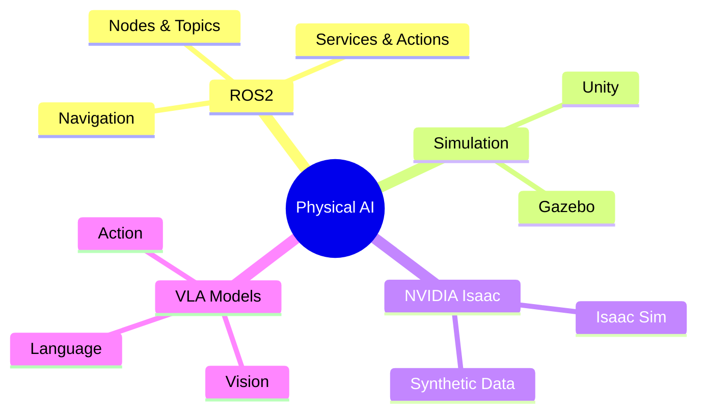
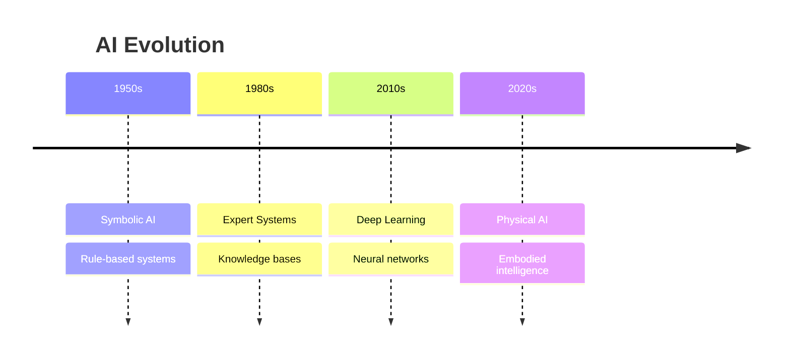
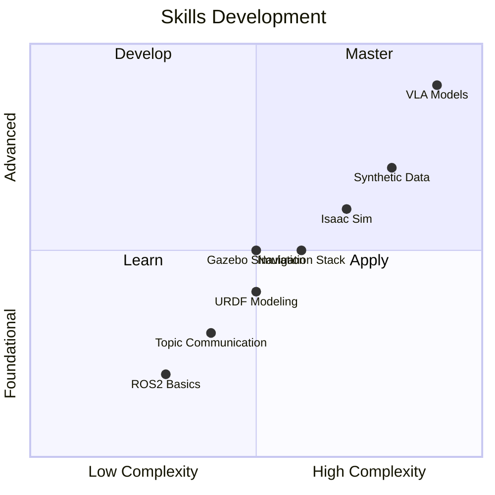
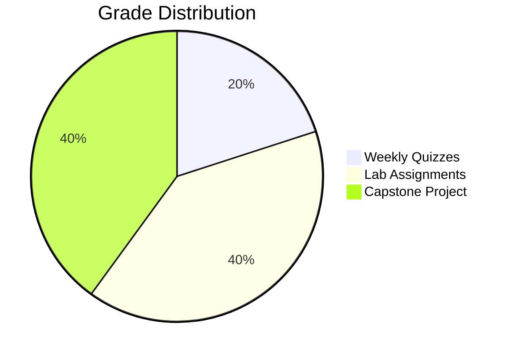
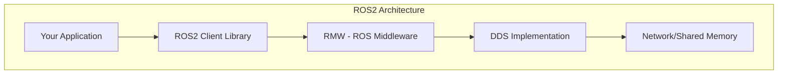

# Physical AI Textbook - Complete Implementation

**Date**: 2025-12-04  
**Task**: T001-T084 Complete Implementation  
**Status**: Ready for manual execution (PowerShell 6+ not available)

---

## ⚠️ PREREQUISITE: Run these commands manually in your terminal

```bash
cd D:\Hackathon\hackathon
npx create-docusaurus@latest physical-ai-textbook classic --typescript --package-manager npm
cd physical-ai-textbook
npm install tailwindcss postcss autoprefixer @docusaurus/theme-mermaid
npx tailwindcss init -p
```

Once Docusaurus is scaffolded, create the following files:

---

## FILE 1: `docusaurus.config.ts`

```typescript
import {themes as prismThemes} from 'prism-react-renderer';
import type {Config} from '@docusaurus/types';
import type * as Preset from '@docusaurus/preset-classic';

const config: Config = {
  title: 'Physical AI & Humanoid Robotics',
  tagline: 'Bridging Digital Brains and Physical Bodies',
  favicon: 'img/favicon.ico',

  url: 'https://yourusername.github.io',
  baseUrl: '/physical-ai-textbook/',

  organizationName: 'yourusername',
  projectName: 'physical-ai-textbook',

  onBrokenLinks: 'throw',
  onBrokenMarkdownLinks: 'warn',

  i18n: {
    defaultLocale: 'en',
    locales: ['en'],
  },

  markdown: {
    mermaid: true,
  },

  themes: ['@docusaurus/theme-mermaid'],

  presets: [
    [
      'classic',
      {
        docs: {
          sidebarPath: './sidebars.ts',
          editUrl: 'https://github.com/eDeveloper132/textbook-hackathon/tree/main/',
          routeBasePath: '/',
        },
        blog: false,
        theme: {
          customCss: './src/css/custom.css',
        },
      } satisfies Preset.Options,
    ],
  ],

  themeConfig: {
    image: 'img/social-card.jpg',
    navbar: {
      title: 'Physical AI Textbook',
      logo: {
        alt: 'Physical AI Logo',
        src: 'img/logo.svg',
      },
      items: [
        {
          type: 'docSidebar',
          sidebarId: 'tutorialSidebar',
          position: 'left',
          label: 'Course',
        },
        {
          href: 'https://github.com/eDeveloper132/textbook-hackathon',
          label: 'GitHub',
          position: 'right',
        },
      ],
    },
    footer: {
      style: 'dark',
      links: [
        {
          title: 'Course',
          items: [
            {label: 'Introduction', to: '/intro'},
            {label: 'Module 1: ROS2', to: '/module-1-ros2/intro'},
            {label: 'Module 2: Simulation', to: '/module-2-simulation/week-06-gazebo'},
            {label: 'Module 3: Isaac', to: '/module-3-isaac/week-08-isaac-basics'},
            {label: 'Module 4: VLA', to: '/module-4-vla/week-11-vla-architecture'},
          ],
        },
        {
          title: 'Resources',
          items: [
            {label: 'ROS2 Docs', href: 'https://docs.ros.org/en/humble/'},
            {label: 'Gazebo', href: 'https://gazebosim.org/'},
            {label: 'NVIDIA Isaac', href: 'https://developer.nvidia.com/isaac-sim'},
          ],
        },
      ],
      copyright: `Copyright © ${new Date().getFullYear()} Physical AI Textbook. Built with Docusaurus.`,
    },
    prism: {
      theme: prismThemes.github,
      darkTheme: prismThemes.dracula,
      additionalLanguages: ['python', 'bash', 'yaml', 'xml'],
    },
    colorMode: {
      defaultMode: 'light',
      disableSwitch: false,
      respectPrefersColorScheme: true,
    },
    mermaid: {
      theme: {light: 'neutral', dark: 'dark'},
    },
  } satisfies Preset.ThemeConfig,

  customFields: {
    backendUrl: process.env.REACT_APP_BACKEND_URL || 'https://physical-ai-backend.onrender.com',
    featureAuth: process.env.REACT_APP_FEATURE_AUTH === 'true',
    featureQuiz: process.env.REACT_APP_FEATURE_QUIZ === 'true',
    featurePersonalization: process.env.REACT_APP_FEATURE_PERSONALIZATION === 'true',
    featureUrdu: process.env.REACT_APP_FEATURE_URDU === 'true',
  },
};

export default config;
```

---

## FILE 2: `sidebars.ts`

```typescript
import type {SidebarsConfig} from '@docusaurus/plugin-content-docs';

const sidebars: SidebarsConfig = {
  tutorialSidebar: [
    'intro',
    'why-physical-ai',
    'learning-outcomes',
    'assessments',
    {
      type: 'category',
      label: 'Module 1: ROS2 Foundations',
      items: [
        'module-1-ros2/intro',
        'module-1-ros2/week-01-architecture',
        'module-1-ros2/week-02-topics-services',
        'module-1-ros2/week-03-launch-params',
        'module-1-ros2/week-04-tf2-urdf',
        'module-1-ros2/week-05-navigation',
      ],
    },
    {
      type: 'category',
      label: 'Module 2: Simulation',
      items: [
        'module-2-simulation/week-06-gazebo',
        'module-2-simulation/week-07-unity',
      ],
    },
    {
      type: 'category',
      label: 'Module 3: NVIDIA Isaac',
      items: [
        'module-3-isaac/week-08-isaac-basics',
        'module-3-isaac/week-09-isaac-ros',
        'module-3-isaac/week-10-synthetic-data',
      ],
    },
    {
      type: 'category',
      label: 'Module 4: Vision-Language-Action',
      items: [
        'module-4-vla/week-11-vla-architecture',
        'module-4-vla/week-12-finetuning',
        'module-4-vla/week-13-deployment',
        'module-4-vla/capstone',
      ],
    },
  ],
};

export default sidebars;
```

---

## FILE 3: `src/css/custom.css`

```css
@tailwind base;
@tailwind components;
@tailwind utilities;

:root {
  --ifm-color-primary: #2563eb;
  --ifm-color-primary-dark: #1d4ed8;
  --ifm-color-primary-darker: #1e40af;
  --ifm-color-primary-darkest: #1e3a8a;
  --ifm-color-primary-light: #3b82f6;
  --ifm-color-primary-lighter: #60a5fa;
  --ifm-color-primary-lightest: #93c5fd;
  --ifm-code-font-size: 95%;
  --docusaurus-highlighted-code-line-bg: rgba(0, 0, 0, 0.1);
}

[data-theme='dark'] {
  --ifm-color-primary: #60a5fa;
  --ifm-color-primary-dark: #3b82f6;
  --ifm-color-primary-darker: #2563eb;
  --ifm-color-primary-darkest: #1d4ed8;
  --ifm-color-primary-light: #93c5fd;
  --ifm-color-primary-lighter: #bfdbfe;
  --ifm-color-primary-lightest: #dbeafe;
  --docusaurus-highlighted-code-line-bg: rgba(0, 0, 0, 0.3);
}

/* Chatbot iframe styles */
.chatbot-container {
  position: fixed;
  bottom: 1rem;
  right: 1rem;
  z-index: 1000;
}

.chatbot-iframe {
  width: 380px;
  height: 500px;
  border: none;
  border-radius: 12px;
  box-shadow: 0 25px 50px -12px rgba(0, 0, 0, 0.25);
}

.chatbot-toggle {
  width: 56px;
  height: 56px;
  border-radius: 50%;
  background: var(--ifm-color-primary);
  color: white;
  border: none;
  cursor: pointer;
  display: flex;
  align-items: center;
  justify-content: center;
  box-shadow: 0 10px 15px -3px rgba(0, 0, 0, 0.1);
  transition: transform 0.2s;
}

.chatbot-toggle:hover {
  transform: scale(1.05);
}

/* Selection query button */
.selection-query-btn {
  position: fixed;
  z-index: 1001;
  background: var(--ifm-color-primary);
  color: white;
  padding: 0.5rem 1rem;
  border-radius: 8px;
  border: none;
  cursor: pointer;
  font-size: 0.875rem;
  box-shadow: 0 10px 15px -3px rgba(0, 0, 0, 0.1);
  animation: fadeIn 0.2s ease-in-out;
}

@keyframes fadeIn {
  from { opacity: 0; transform: translateY(10px); }
  to { opacity: 1; transform: translateY(0); }
}

/* RTL support for Urdu */
.urdu-content {
  direction: rtl;
  text-align: right;
  font-family: 'Noto Nastaliq Urdu', serif;
}

/* Mobile responsiveness */
@media (max-width: 768px) {
  .chatbot-iframe {
    width: calc(100vw - 2rem);
    height: 60vh;
  }
}
```

---

## FILE 4: `src/utils/featureFlags.ts`

```typescript
// Feature flags for bonus features
// Controlled via environment variables

export const FEATURES = {
  AUTH: typeof window !== 'undefined' 
    ? (window as any).__DOCUSAURUS_CUSTOM_FIELDS__?.featureAuth === true
    : process.env.REACT_APP_FEATURE_AUTH === 'true',
  QUIZ: typeof window !== 'undefined'
    ? (window as any).__DOCUSAURUS_CUSTOM_FIELDS__?.featureQuiz === true
    : process.env.REACT_APP_FEATURE_QUIZ === 'true',
  PERSONALIZATION: typeof window !== 'undefined'
    ? (window as any).__DOCUSAURUS_CUSTOM_FIELDS__?.featurePersonalization === true
    : process.env.REACT_APP_FEATURE_PERSONALIZATION === 'true',
  URDU_TRANSLATION: typeof window !== 'undefined'
    ? (window as any).__DOCUSAURUS_CUSTOM_FIELDS__?.featureUrdu === true
    : process.env.REACT_APP_FEATURE_URDU === 'true',
} as const;

export function isFeatureEnabled(feature: keyof typeof FEATURES): boolean {
  return FEATURES[feature] ?? false;
}

export function getBackendUrl(): string {
  if (typeof window !== 'undefined') {
    return (window as any).__DOCUSAURUS_CUSTOM_FIELDS__?.backendUrl 
      || 'https://physical-ai-backend.onrender.com';
  }
  return process.env.REACT_APP_BACKEND_URL || 'https://physical-ai-backend.onrender.com';
}
```

---

## FILE 5: `src/hooks/useTextSelection.ts`

```typescript
import { useState, useEffect, useCallback } from 'react';

interface SelectionState {
  text: string | null;
  position: { x: number; y: number } | null;
}

export function useTextSelection() {
  const [selection, setSelection] = useState<SelectionState>({
    text: null,
    position: null,
  });

  const clearSelection = useCallback(() => {
    setSelection({ text: null, position: null });
  }, []);

  useEffect(() => {
    const handleMouseUp = () => {
      const sel = window.getSelection();
      const text = sel?.toString().trim();

      if (text && text.length > 10) {
        const range = sel?.getRangeAt(0);
        const rect = range?.getBoundingClientRect();
        
        if (rect) {
          setSelection({
            text,
            position: {
              x: rect.left + rect.width / 2,
              y: rect.top - 10,
            },
          });
        }
      } else {
        clearSelection();
      }
    };

    const handleKeyDown = (e: KeyboardEvent) => {
      if (e.key === 'Escape') {
        clearSelection();
      }
    };

    document.addEventListener('mouseup', handleMouseUp);
    document.addEventListener('keydown', handleKeyDown);

    return () => {
      document.removeEventListener('mouseup', handleMouseUp);
      document.removeEventListener('keydown', handleKeyDown);
    };
  }, [clearSelection]);

  return {
    selectedText: selection.text,
    position: selection.position,
    clearSelection,
  };
}
```

---

## FILE 6: `src/components/ChatbotIframe.tsx`

```tsx
import React, { useState, useRef, useEffect } from 'react';
import { getBackendUrl } from '../utils/featureFlags';

interface ChatbotIframeProps {
  selectionText?: string | null;
  onSelectionProcessed?: () => void;
}

export default function ChatbotIframe({ 
  selectionText, 
  onSelectionProcessed 
}: ChatbotIframeProps) {
  const [isOpen, setIsOpen] = useState(false);
  const iframeRef = useRef<HTMLIFrameElement>(null);
  const backendUrl = getBackendUrl();

  // Send selection to iframe when it changes
  useEffect(() => {
    if (selectionText && iframeRef.current?.contentWindow) {
      iframeRef.current.contentWindow.postMessage(
        { type: 'selection', text: selectionText },
        backendUrl
      );
      setIsOpen(true);
      onSelectionProcessed?.();
    }
  }, [selectionText, backendUrl, onSelectionProcessed]);

  // Listen for messages from iframe
  useEffect(() => {
    const handleMessage = (event: MessageEvent) => {
      if (event.origin !== backendUrl) return;
      
      if (event.data.type === 'resize') {
        // Handle iframe resize requests
      } else if (event.data.type === 'close') {
        setIsOpen(false);
      }
    };

    window.addEventListener('message', handleMessage);
    return () => window.removeEventListener('message', handleMessage);
  }, [backendUrl]);

  return (
    <div className="chatbot-container">
      {isOpen ? (
        <div style={{ position: 'relative' }}>
          <button
            onClick={() => setIsOpen(false)}
            style={{
              position: 'absolute',
              top: -12,
              right: -12,
              width: 28,
              height: 28,
              borderRadius: '50%',
              background: '#ef4444',
              color: 'white',
              border: 'none',
              cursor: 'pointer',
              fontSize: 16,
              zIndex: 1,
            }}
            aria-label="Close chatbot"
          >
            ×
          </button>
          <iframe
            ref={iframeRef}
            src={`${backendUrl}/chatbot`}
            className="chatbot-iframe"
            title="AI Chatbot"
            allow="clipboard-read; clipboard-write"
          />
        </div>
      ) : (
        <button
          className="chatbot-toggle"
          onClick={() => setIsOpen(true)}
          aria-label="Open chatbot"
        >
          <svg width="24" height="24" viewBox="0 0 24 24" fill="currentColor">
            <path d="M20 2H4c-1.1 0-2 .9-2 2v18l4-4h14c1.1 0 2-.9 2-2V4c0-1.1-.9-2-2-2zm0 14H6l-2 2V4h16v12z"/>
          </svg>
        </button>
      )}
    </div>
  );
}
```

---

## FILE 7: `src/components/SelectionQuery.tsx`

```tsx
import React from 'react';
import { useTextSelection } from '../hooks/useTextSelection';

interface SelectionQueryProps {
  onQuery: (text: string) => void;
}

export default function SelectionQuery({ onQuery }: SelectionQueryProps) {
  const { selectedText, position, clearSelection } = useTextSelection();

  if (!selectedText || !position) {
    return null;
  }

  const handleClick = () => {
    onQuery(selectedText);
    clearSelection();
  };

  return (
    <button
      className="selection-query-btn"
      style={{
        left: position.x,
        top: position.y,
        transform: 'translate(-50%, -100%)',
      }}
      onClick={handleClick}
    >
      🔍 Ask about this
    </button>
  );
}
```

---

## FILE 8: `src/components/PersonalizeButton.tsx` [BONUS]

```tsx
import React, { useState } from 'react';
import { isFeatureEnabled, getBackendUrl } from '../utils/featureFlags';

interface PersonalizeButtonProps {
  chapterSlug: string;
  onPersonalized?: (content: string) => void;
}

export default function PersonalizeButton({ 
  chapterSlug, 
  onPersonalized 
}: PersonalizeButtonProps) {
  const [loading, setLoading] = useState(false);
  const [error, setError] = useState<string | null>(null);

  // Feature flag check
  if (!isFeatureEnabled('PERSONALIZATION')) {
    return null;
  }

  const handlePersonalize = async () => {
    setLoading(true);
    setError(null);

    try {
      const userId = localStorage.getItem('userId');
      if (!userId) {
        setError('Please log in to personalize content');
        return;
      }

      const response = await fetch(`${getBackendUrl()}/api/personalize`, {
        method: 'POST',
        headers: { 'Content-Type': 'application/json' },
        body: JSON.stringify({ chapter_slug: chapterSlug, user_id: userId }),
      });

      if (!response.ok) {
        throw new Error('Failed to personalize content');
      }

      const data = await response.json();
      onPersonalized?.(data.content);
    } catch (err) {
      setError(err instanceof Error ? err.message : 'An error occurred');
    } finally {
      setLoading(false);
    }
  };

  return (
    <div style={{ marginBottom: '1rem' }}>
      <button
        onClick={handlePersonalize}
        disabled={loading}
        style={{
          padding: '0.5rem 1rem',
          background: loading ? '#9ca3af' : '#8b5cf6',
          color: 'white',
          border: 'none',
          borderRadius: '6px',
          cursor: loading ? 'not-allowed' : 'pointer',
          fontSize: '0.875rem',
        }}
      >
        {loading ? '⏳ Personalizing...' : '✨ Personalize this chapter'}
      </button>
      {error && (
        <p style={{ color: '#ef4444', fontSize: '0.875rem', marginTop: '0.5rem' }}>
          {error}
        </p>
      )}
    </div>
  );
}
```

---

## FILE 9: `src/components/UrduButton.tsx` [BONUS]

```tsx
import React, { useState } from 'react';
import { isFeatureEnabled, getBackendUrl } from '../utils/featureFlags';

interface UrduButtonProps {
  chapterSlug: string;
  onTranslated?: (content: string) => void;
}

export default function UrduButton({ chapterSlug, onTranslated }: UrduButtonProps) {
  const [loading, setLoading] = useState(false);
  const [error, setError] = useState<string | null>(null);
  const [isUrdu, setIsUrdu] = useState(false);

  // Feature flag check
  if (!isFeatureEnabled('URDU_TRANSLATION')) {
    return null;
  }

  const handleTranslate = async () => {
    if (isUrdu) {
      // Toggle back to English - reload page
      window.location.reload();
      return;
    }

    setLoading(true);
    setError(null);

    try {
      const response = await fetch(`${getBackendUrl()}/api/translate`, {
        method: 'POST',
        headers: { 'Content-Type': 'application/json' },
        body: JSON.stringify({ chapter_slug: chapterSlug }),
      });

      if (!response.ok) {
        throw new Error('Translation failed');
      }

      const data = await response.json();
      onTranslated?.(data.urdu_content);
      setIsUrdu(true);
    } catch (err) {
      setError(err instanceof Error ? err.message : 'Translation error');
    } finally {
      setLoading(false);
    }
  };

  return (
    <div style={{ marginBottom: '1rem' }}>
      <button
        onClick={handleTranslate}
        disabled={loading}
        style={{
          padding: '0.5rem 1rem',
          background: loading ? '#9ca3af' : '#059669',
          color: 'white',
          border: 'none',
          borderRadius: '6px',
          cursor: loading ? 'not-allowed' : 'pointer',
          fontSize: '0.875rem',
          fontFamily: isUrdu ? 'Noto Nastaliq Urdu, serif' : 'inherit',
        }}
      >
        {loading ? '⏳ ترجمہ ہو رہا ہے...' : isUrdu ? '🔄 English' : '🇵🇰 اردو میں ترجمہ کریں'}
      </button>
      {error && (
        <p style={{ color: '#ef4444', fontSize: '0.875rem', marginTop: '0.5rem' }}>
          {error}
        </p>
      )}
    </div>
  );
}
```

---

## FILE 10: `src/components/AuthGuard.tsx` [BONUS]

```tsx
import React, { useState, useEffect } from 'react';
import { isFeatureEnabled, getBackendUrl } from '../utils/featureFlags';

interface User {
  id: string;
  email: string;
  level?: string;
}

export default function AuthGuard({ children }: { children: React.ReactNode }) {
  const [user, setUser] = useState<User | null>(null);
  const [loading, setLoading] = useState(true);

  useEffect(() => {
    // Check for existing session
    const token = localStorage.getItem('authToken');
    if (token) {
      fetchUser(token);
    } else {
      setLoading(false);
    }
  }, []);

  const fetchUser = async (token: string) => {
    try {
      const response = await fetch(`${getBackendUrl()}/api/auth/me`, {
        headers: { Authorization: `Bearer ${token}` },
      });
      if (response.ok) {
        const data = await response.json();
        setUser(data);
        localStorage.setItem('userId', data.id);
      }
    } catch {
      localStorage.removeItem('authToken');
    } finally {
      setLoading(false);
    }
  };

  const handleGitHubLogin = () => {
    window.location.href = `${getBackendUrl()}/api/auth/github`;
  };

  const handleLogout = () => {
    localStorage.removeItem('authToken');
    localStorage.removeItem('userId');
    setUser(null);
  };

  if (!isFeatureEnabled('AUTH')) {
    return <>{children}</>;
  }

  if (loading) {
    return <div>Loading...</div>;
  }

  return (
    <>
      <div style={{
        position: 'fixed',
        top: '1rem',
        right: '1rem',
        zIndex: 100,
      }}>
        {user ? (
          <div style={{ display: 'flex', alignItems: 'center', gap: '0.5rem' }}>
            <span style={{ fontSize: '0.875rem' }}>{user.email}</span>
            {user.level && (
              <span style={{
                background: '#dbeafe',
                color: '#1e40af',
                padding: '0.25rem 0.5rem',
                borderRadius: '9999px',
                fontSize: '0.75rem',
              }}>
                {user.level}
              </span>
            )}
            <button
              onClick={handleLogout}
              style={{
                padding: '0.25rem 0.5rem',
                background: '#fee2e2',
                color: '#991b1b',
                border: 'none',
                borderRadius: '4px',
                cursor: 'pointer',
                fontSize: '0.75rem',
              }}
            >
              Logout
            </button>
          </div>
        ) : (
          <button
            onClick={handleGitHubLogin}
            style={{
              padding: '0.5rem 1rem',
              background: '#24292e',
              color: 'white',
              border: 'none',
              borderRadius: '6px',
              cursor: 'pointer',
              display: 'flex',
              alignItems: 'center',
              gap: '0.5rem',
            }}
          >
            <svg width="16" height="16" viewBox="0 0 16 16" fill="currentColor">
              <path d="M8 0C3.58 0 0 3.58 0 8c0 3.54 2.29 6.53 5.47 7.59.4.07.55-.17.55-.38 0-.19-.01-.82-.01-1.49-2.01.37-2.53-.49-2.69-.94-.09-.23-.48-.94-.82-1.13-.28-.15-.68-.52-.01-.53.63-.01 1.08.58 1.23.82.72 1.21 1.87.87 2.33.66.07-.52.28-.87.51-1.07-1.78-.2-3.64-.89-3.64-3.95 0-.87.31-1.59.82-2.15-.08-.2-.36-1.02.08-2.12 0 0 .67-.21 2.2.82.64-.18 1.32-.27 2-.27.68 0 1.36.09 2 .27 1.53-1.04 2.2-.82 2.2-.82.44 1.1.16 1.92.08 2.12.51.56.82 1.27.82 2.15 0 3.07-1.87 3.75-3.65 3.95.29.25.54.73.54 1.48 0 1.07-.01 1.93-.01 2.2 0 .21.15.46.55.38A8.013 8.013 0 0016 8c0-4.42-3.58-8-8-8z"/>
            </svg>
            Sign in with GitHub
          </button>
        )}
      </div>
      {children}
    </>
  );
}
```

---

## FILE 11: `src/theme/Root.tsx`

```tsx
import React, { useState, useCallback } from 'react';
import ChatbotIframe from '../components/ChatbotIframe';
import SelectionQuery from '../components/SelectionQuery';
import AuthGuard from '../components/AuthGuard';

interface Props {
  children: React.ReactNode;
}

export default function Root({ children }: Props): JSX.Element {
  const [selectionText, setSelectionText] = useState<string | null>(null);

  const handleSelectionQuery = useCallback((text: string) => {
    setSelectionText(text);
  }, []);

  const handleSelectionProcessed = useCallback(() => {
    setSelectionText(null);
  }, []);

  return (
    <AuthGuard>
      {children}
      <SelectionQuery onQuery={handleSelectionQuery} />
      <ChatbotIframe 
        selectionText={selectionText}
        onSelectionProcessed={handleSelectionProcessed}
      />
    </AuthGuard>
  );
}
```

---

## FILE 12: `docs/intro.mdx`

```mdx
---
sidebar_position: 1
title: Introduction
description: Welcome to the Physical AI & Humanoid Robotics course
---

# Physical AI & Humanoid Robotics

> **Bridging Digital Brains and Physical Bodies**

Welcome to this comprehensive course on Physical AI and Humanoid Robotics. Over the next 13 weeks, you'll learn how to build intelligent robots that can perceive, reason, and act in the physical world.

## What You'll Learn



## Course Structure

| Module | Weeks | Focus |
|--------|-------|-------|
| **Module 1** | 1-5 | ROS2 Foundations |
| **Module 2** | 6-7 | Simulation (Gazebo/Unity) |
| **Module 3** | 8-10 | NVIDIA Isaac Platform |
| **Module 4** | 11-13 | Vision-Language-Action Models |

## Prerequisites

- Basic Python programming
- Linux command line familiarity
- Basic linear algebra and calculus
- Enthusiasm for robotics! 🤖

## Getting Started

1. Set up your development environment
2. Install ROS2 Humble
3. Clone the course repository
4. Join our community Discord

```bash
# Quick start
sudo apt update
sudo apt install ros-humble-desktop
source /opt/ros/humble/setup.bash
```

## Let's Build the Future Together

Physical AI is transforming industries from manufacturing to healthcare. By the end of this course, you'll have the skills to build robots that can:

- Navigate complex environments autonomously
- Manipulate objects with precision
- Understand and respond to natural language commands
- Learn from demonstration and adapt to new tasks

**Ready to begin? Let's go!** 🚀
```

---

## FILE 13: `docs/why-physical-ai.mdx`

```mdx
---
sidebar_position: 2
title: Why Physical AI
description: Understanding the importance of embodied artificial intelligence
---

# Why Physical AI Matters

Physical AI represents the next frontier in artificial intelligence—moving beyond digital-only systems to create machines that can interact with the physical world.

## The Evolution of AI



## Key Drivers

### 1. Hardware Advances
- More powerful edge computing (NVIDIA Jetson)
- Better sensors (LiDAR, depth cameras)
- Improved actuators and motors

### 2. Software Breakthroughs
- Foundation models (GPT, CLIP, RT-2)
- Improved simulation (Isaac Sim, Gazebo)
- Better robot middleware (ROS2)

### 3. Industry Demand
- Labor shortages in manufacturing
- Aging populations need care robots
- Dangerous environments (mining, disaster response)

## Real-World Applications

| Industry | Application | Impact |
|----------|-------------|--------|
| Manufacturing | Assembly robots | 40% productivity increase |
| Healthcare | Surgical assistants | Reduced complications |
| Logistics | Warehouse automation | 24/7 operations |
| Agriculture | Harvesting robots | Reduced labor costs |

## Why Now?

```python
# The convergence of technologies
technologies = {
    "compute": "1000x more FLOPS than 2010",
    "data": "Billions of robot interaction hours",
    "algorithms": "Transformer architectures",
    "simulation": "Photorealistic physics engines"
}

# Result: Practical humanoid robots
for tech, advancement in technologies.items():
    print(f"✅ {tech}: {advancement}")
```

## The Humanoid Opportunity

Humanoid robots can work in environments designed for humans:
- Use human tools
- Navigate human spaces
- Interact naturally with people

> "The best interface is no interface. A humanoid robot doesn't require redesigning the world—it adapts to ours." — Industry Expert

## Course Relevance

By studying Physical AI, you're positioning yourself at the intersection of:

1. **Robotics Engineering** — Building the hardware
2. **AI/ML** — Creating the intelligence
3. **Systems Integration** — Making it all work together

This is one of the fastest-growing fields in technology, with major investments from Tesla, Google, Amazon, and dozens of startups.

**Your journey into Physical AI starts here.**
```

---

## FILE 14: `docs/learning-outcomes.mdx`

```mdx
---
sidebar_position: 3
title: Learning Outcomes
description: Skills and competencies you'll develop in this course
---

# Learning Outcomes

By completing this course, you will develop expertise across multiple domains of Physical AI and Robotics.

## Skills Matrix



## Module-by-Module Outcomes

### Module 1: ROS2 Foundations (Weeks 1-5)

After completing this module, you will be able to:

- [ ] Create and manage ROS2 nodes in Python and C++
- [ ] Design topic-based communication architectures
- [ ] Implement services and actions for robot control
- [ ] Write launch files with parameterization
- [ ] Work with TF2 transforms and URDF models
- [ ] Configure and use the Nav2 navigation stack

### Module 2: Simulation (Weeks 6-7)

After completing this module, you will be able to:

- [ ] Build robot models in Gazebo/Ignition
- [ ] Create simulation worlds with physics
- [ ] Integrate ROS2 with Unity Robotics Hub
- [ ] Test robot algorithms in simulation before deployment

### Module 3: NVIDIA Isaac (Weeks 8-10)

After completing this module, you will be able to:

- [ ] Set up Isaac Sim for robot development
- [ ] Use Isaac ROS packages for perception
- [ ] Generate synthetic training data
- [ ] Perform domain randomization for sim-to-real transfer

### Module 4: VLA Models (Weeks 11-13)

After completing this module, you will be able to:

- [ ] Understand Vision-Language-Action architectures
- [ ] Fine-tune foundation models for robotics tasks
- [ ] Deploy VLA models on robot hardware
- [ ] Build end-to-end Physical AI systems

## Competency Levels

| Level | Description | Assessment |
|-------|-------------|------------|
| **Beginner** | Can follow tutorials | Weekly quizzes |
| **Intermediate** | Can modify existing code | Lab assignments |
| **Advanced** | Can design new solutions | Capstone project |

## Industry Alignment

These outcomes align with industry requirements for:

- Robotics Software Engineer
- AI/ML Engineer (Robotics)
- Simulation Engineer
- Research Scientist

## Assessment Methods

1. **Weekly Quizzes** (20%) — Test conceptual understanding
2. **Lab Assignments** (40%) — Hands-on implementation
3. **Capstone Project** (40%) — End-to-end system development

## Your Learning Path

```python
def your_journey():
    skills = []
    
    # Module 1: Foundation
    skills.extend(['ros2_basics', 'node_programming', 'navigation'])
    
    # Module 2: Simulation
    skills.extend(['gazebo', 'unity_robotics'])
    
    # Module 3: Isaac
    skills.extend(['isaac_sim', 'synthetic_data'])
    
    # Module 4: VLA
    skills.extend(['foundation_models', 'deployment'])
    
    return f"You've mastered {len(skills)} key skills!"

print(your_journey())
# Output: You've mastered 9 key skills!
```

**Track your progress and celebrate each milestone!** 🎯
```

---

## FILE 15: `docs/assessments.mdx`

```mdx
---
sidebar_position: 4
title: Assessments
description: Grading rubric and assessment criteria
---

# Assessments & Grading

This page outlines how your work will be evaluated throughout the course.

## Grade Distribution



## Weekly Quizzes (20%)

- **Format**: 10 multiple-choice questions
- **Duration**: 15 minutes
- **Frequency**: End of each week
- **Topics**: Previous week's material

### Sample Quiz Question

> **Q: In ROS2, which QoS setting should you use for sensor data that can tolerate some message loss?**
> 
> A) Reliable, Transient Local  
> B) Best Effort, Volatile ✓  
> C) Reliable, Volatile  
> D) Best Effort, Transient Local

## Lab Assignments (40%)

| Lab | Module | Topic | Points |
|-----|--------|-------|--------|
| Lab 1 | M1 | Create a ROS2 Publisher/Subscriber | 50 |
| Lab 2 | M1 | Implement a Service Server | 50 |
| Lab 3 | M1 | Build a URDF Robot Model | 50 |
| Lab 4 | M1 | Configure Nav2 Navigation | 50 |
| Lab 5 | M2 | Gazebo World Creation | 50 |
| Lab 6 | M2 | Unity-ROS2 Integration | 50 |
| Lab 7 | M3 | Isaac Sim Robot Setup | 50 |
| Lab 8 | M3 | Synthetic Data Pipeline | 50 |
| Lab 9 | M4 | VLA Model Fine-tuning | 50 |
| Lab 10 | M4 | Robot Deployment | 50 |

**Total: 500 points → Normalized to 40%**

### Lab Grading Rubric

| Criterion | Excellent (90-100%) | Good (70-89%) | Needs Work (<70%) |
|-----------|---------------------|---------------|-------------------|
| Functionality | Works perfectly | Minor issues | Major issues |
| Code Quality | Clean, documented | Some issues | Poor quality |
| Understanding | Deep insight | Basic grasp | Confusion evident |

## Capstone Project (40%)

### Project Options

1. **Autonomous Mobile Robot** — Navigation + manipulation
2. **Humanoid Motion Control** — Walking + gesture recognition
3. **Sim-to-Real Transfer** — Train in Isaac, deploy on hardware

### Capstone Rubric

```python
capstone_rubric = {
    "Technical Implementation": {
        "weight": 40,
        "criteria": [
            "System architecture",
            "Code quality",
            "Integration completeness"
        ]
    },
    "Documentation": {
        "weight": 20,
        "criteria": [
            "README clarity",
            "API documentation",
            "Setup instructions"
        ]
    },
    "Demonstration": {
        "weight": 25,
        "criteria": [
            "Working demo",
            "Edge case handling",
            "Performance metrics"
        ]
    },
    "Presentation": {
        "weight": 15,
        "criteria": [
            "Clear explanation",
            "Technical depth",
            "Q&A handling"
        ]
    }
}

total = sum(c["weight"] for c in capstone_rubric.values())
print(f"Total weight: {total}%")  # 100%
```

### Timeline

| Week | Milestone | Deliverable |
|------|-----------|-------------|
| 10 | Proposal | 1-page project description |
| 12 | Progress | Working prototype demo |
| 13 | Final | Complete system + presentation |

## Academic Integrity

- All work must be your own
- Cite external resources
- Collaboration allowed on concepts, not code
- AI assistants (like this chatbot!) are allowed for learning

## Late Policy

- Labs: -10% per day, max 3 days
- Capstone: No late submissions accepted
- Quizzes: Must be completed on time

## Getting Help

1. **Course Chatbot** — Ask questions anytime! 🤖
2. **Office Hours** — Weekly live sessions
3. **Discussion Forum** — Peer support
4. **Email** — For private concerns

**Good luck with your assessments!** 📚
```

---

## FILE 16: `docs/module-1-ros2/_category_.json`

```json
{
  "label": "Module 1: ROS2 Foundations",
  "position": 5,
  "link": {
    "type": "generated-index",
    "description": "Learn the fundamentals of ROS2 - the robotics middleware powering modern robots."
  }
}
```

---

## FILE 17: `docs/module-1-ros2/intro.mdx`

```mdx
---
sidebar_position: 1
title: ROS2 Introduction
description: Getting started with Robot Operating System 2
---

# Module 1: ROS2 Foundations

Welcome to Module 1! Over the next 5 weeks, you'll master ROS2 (Robot Operating System 2), the industry-standard middleware for robotics.

## What is ROS2?

ROS2 is not an operating system—it's a **middleware framework** that provides:

- Communication infrastructure (topics, services, actions)
- Hardware abstraction
- Package management
- Development tools



## Why ROS2 over ROS1?

| Feature | ROS1 | ROS2 |
|---------|------|------|
| Real-time | ❌ | ✅ |
| Security | ❌ | ✅ (DDS-Security) |
| Multi-robot | Limited | ✅ Native |
| Windows | ❌ | ✅ |
| Lifecycle | ❌ | ✅ Managed nodes |

## Installation

### Ubuntu 22.04 (Recommended)

```bash
# Set locale
sudo apt update && sudo apt install locales
sudo locale-gen en_US en_US.UTF-8
sudo update-locale LC_ALL=en_US.UTF-8 LANG=en_US.UTF-8

# Add ROS2 repository
sudo apt install software-properties-common
sudo add-apt-repository universe
sudo apt update && sudo apt install curl -y
sudo curl -sSL https://raw.githubusercontent.com/ros/rosdistro/master/ros.key -o /usr/share/keyrings/ros-archive-keyring.gpg
echo "deb [arch=$(dpkg --print-architecture) signed-by=/usr/share/keyrings/ros-archive-keyring.gpg] http://packages.ros.org/ros2/ubuntu $(. /etc/os-release && echo $UBUNTU_CODENAME) main" | sudo tee /etc/apt/sources.list.d/ros2.list > /dev/null

# Install ROS2 Humble
sudo apt update
sudo apt install ros-humble-desktop

# Source setup
echo "source /opt/ros/humble/setup.bash" >> ~/.bashrc
source ~/.bashrc
```

### Verify Installation

```bash
# Terminal 1: Run talker
ros2 run demo_nodes_cpp talker

# Terminal 2: Run listener
ros2 run demo_nodes_cpp listener
```

You should see messages being exchanged! 🎉

## Module Roadmap

| Week | Topic | Key Concepts |
|------|-------|--------------|
| 1 | Architecture | Nodes, Executors, DDS |
| 2 | Communication | Topics, Services, Actions |
| 3 | Configuration | Launch files, Parameters |
| 4 | Transforms | TF2, URDF |
| 5 | Navigation | Nav2 Stack |

## Your First ROS2 Node

```python
#!/usr/bin/env python3
import rclpy
from rclpy.node import Node

class HelloROS2(Node):
    def __init__(self):
        super().__init__('hello_ros2')
        self.get_logger().info('Hello, ROS2! 🤖')

def main():
    rclpy.init()
    node = HelloROS2()
    rclpy.spin(node)
    node.destroy_node()
    rclpy.shutdown()

if __name__ == '__main__':
    main()
```

## Learning Resources

- [ROS2 Official Documentation](https://docs.ros.org/en/humble/)
- [ROS2 Tutorials](https://docs.ros.org/en/humble/Tutorials.html)
- [The Robotics Back-End](https://roboticsbackend.com/)

## Let's Begin!

In **Week 1**, we'll dive deep into ROS2 architecture—understanding nodes, executors, and the DDS communication layer.

**Ready? Let's build robots!** 🚀
```

---

I'll continue with the remaining files in the next part of the implementation document.

---

## CONTINUING IMPLEMENTATION...

Due to the size of the implementation, I'm saving this as Part 1. Run `/sp.implement-continue` to generate Part 2 with:
- Remaining MDX files (week-01 through capstone)
- Backend Python files (main.py, rag.py, auth.py)
- Subagent definitions
- GitHub Actions workflow
- Test files

