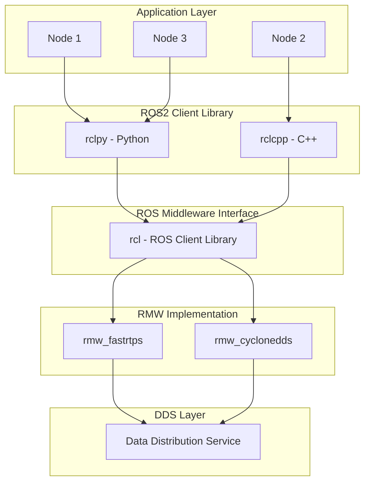
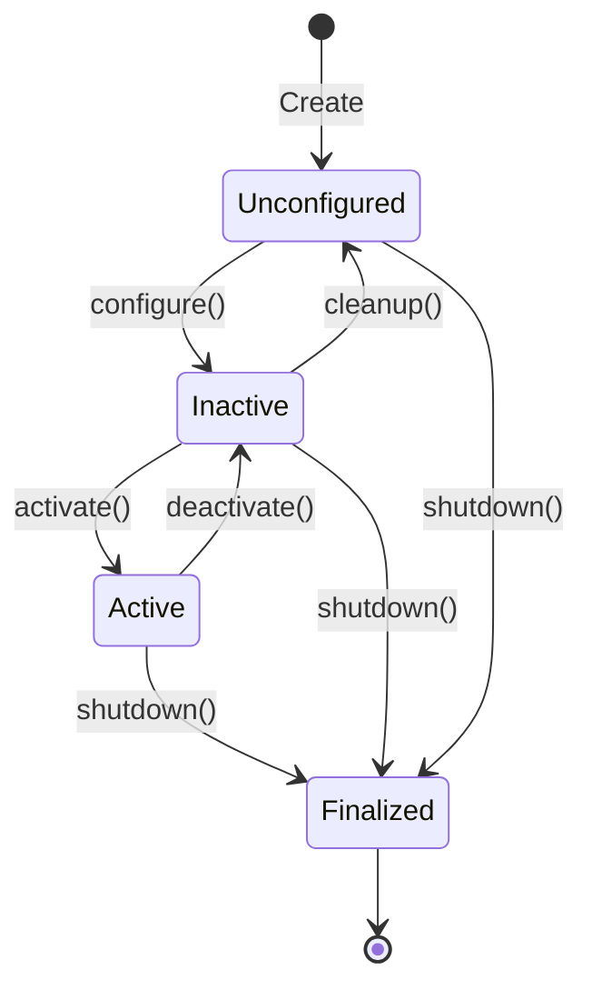
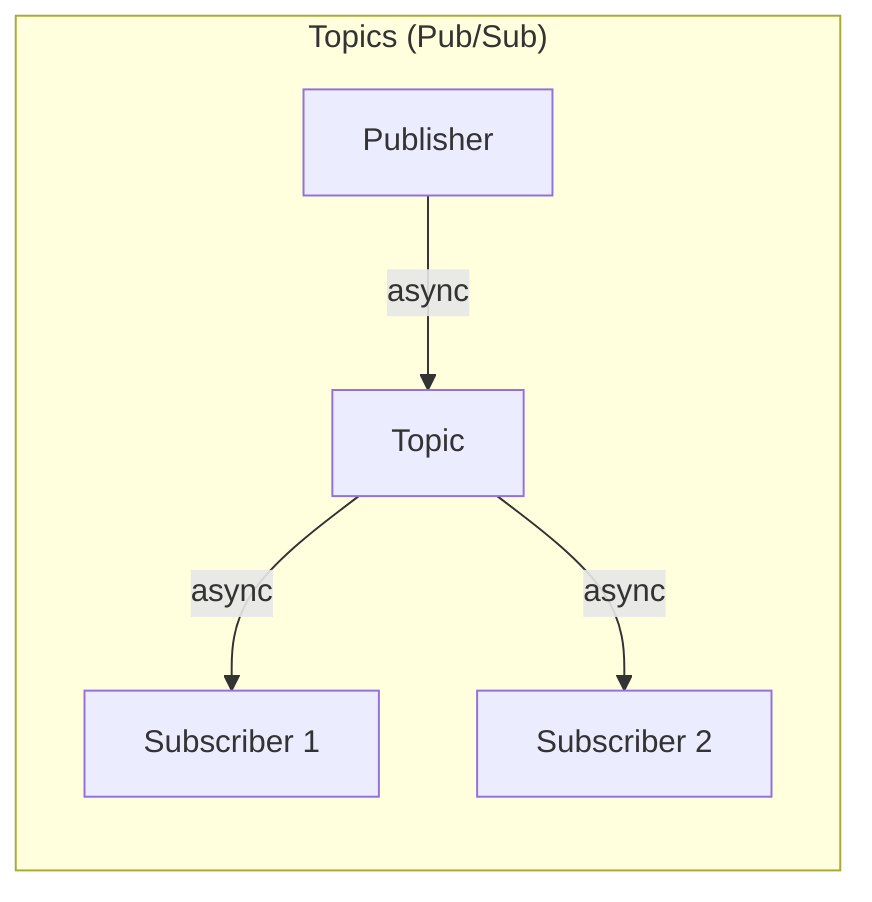
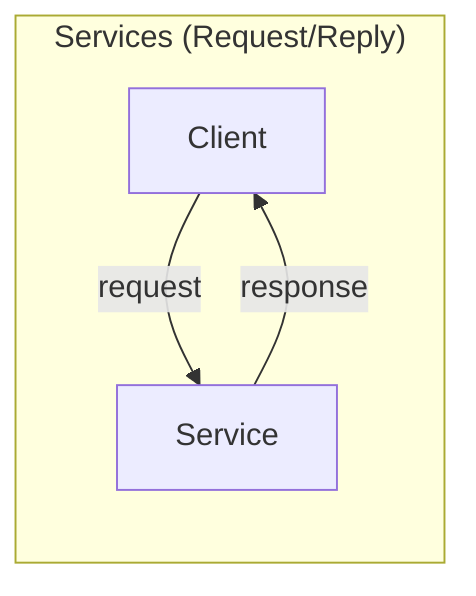
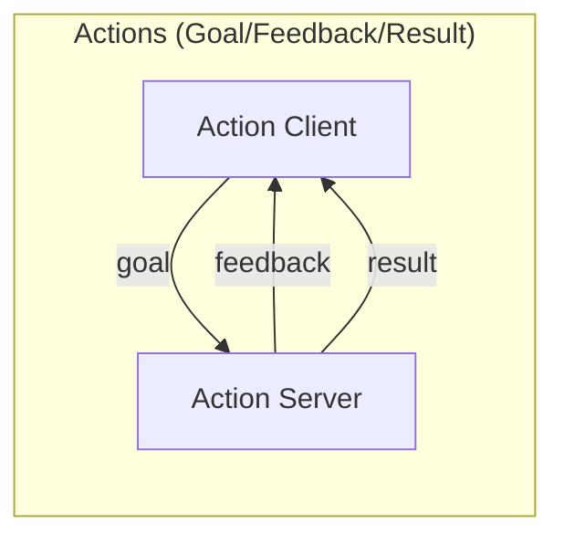
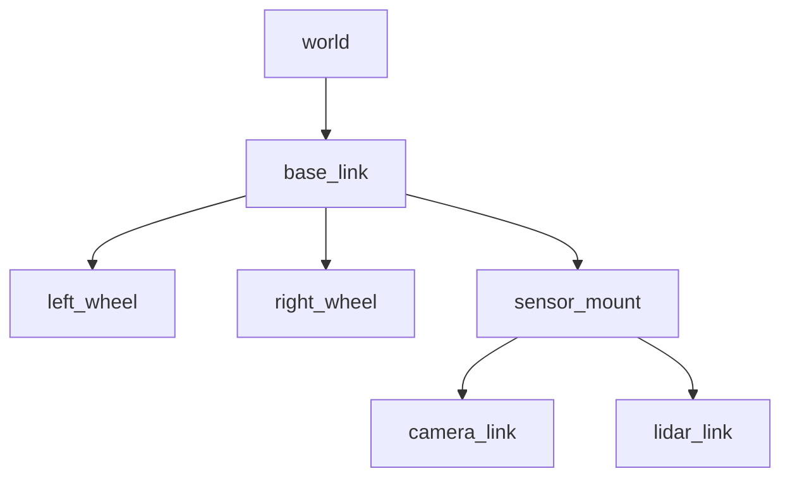
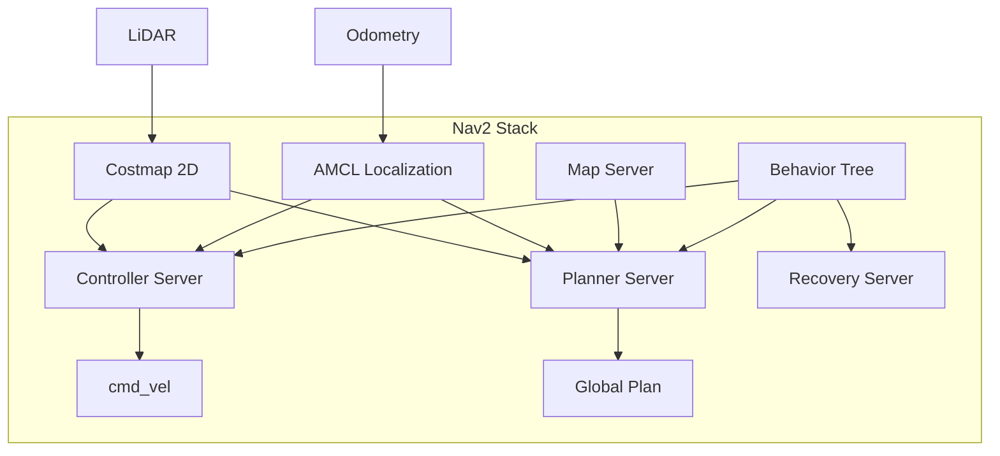
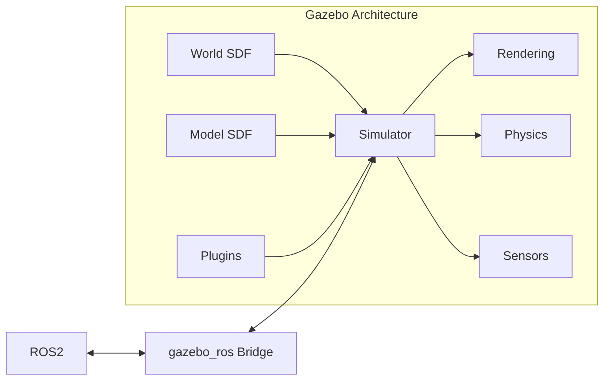

# Physical AI Textbook - Implementation Part 2

**Date**: 2025-12-04  
**Continuation of**: implementation-part1.md

---

## FILE 18: `docs/module-1-ros2/week-01-architecture.mdx`

```mdx
---
sidebar_position: 2
title: "Week 1: ROS2 Architecture"
description: Understanding nodes, executors, and DDS
---

# Week 1: ROS2 Architecture

This week we dive deep into the core architecture of ROS2, understanding how its components work together.

## Learning Objectives

By the end of this week, you will:
- Understand ROS2's layered architecture
- Create and manage nodes
- Configure executors for different use cases
- Understand DDS and QoS settings

## ROS2 Architecture Overview



## Nodes: The Building Blocks

A **node** is a single-purpose executable that communicates with other nodes.

### Creating a Node in Python

```python
#!/usr/bin/env python3
import rclpy
from rclpy.node import Node

class MyRobotNode(Node):
    def __init__(self):
        super().__init__('my_robot_node')
        
        # Create a timer that fires every 1 second
        self.timer = self.create_timer(1.0, self.timer_callback)
        self.counter = 0
        
        self.get_logger().info('Node initialized!')
    
    def timer_callback(self):
        self.counter += 1
        self.get_logger().info(f'Timer fired: {self.counter}')

def main(args=None):
    rclpy.init(args=args)
    node = MyRobotNode()
    
    try:
        rclpy.spin(node)
    except KeyboardInterrupt:
        pass
    finally:
        node.destroy_node()
        rclpy.shutdown()

if __name__ == '__main__':
    main()
```

### Node Lifecycle



## Executors

Executors manage how callbacks are processed.

### Single-Threaded Executor (Default)

```python
import rclpy
from rclpy.executors import SingleThreadedExecutor

rclpy.init()
node = MyRobotNode()
executor = SingleThreadedExecutor()
executor.add_node(node)

try:
    executor.spin()
finally:
    executor.shutdown()
    node.destroy_node()
    rclpy.shutdown()
```

### Multi-Threaded Executor

```python
from rclpy.executors import MultiThreadedExecutor

executor = MultiThreadedExecutor(num_threads=4)
executor.add_node(node1)
executor.add_node(node2)
executor.spin()
```

## DDS and Quality of Service (QoS)

DDS (Data Distribution Service) is the communication standard underlying ROS2.

### QoS Profiles

| Profile | Reliability | Durability | Use Case |
|---------|-------------|------------|----------|
| Sensor Data | Best Effort | Volatile | Camera, LiDAR |
| Parameters | Reliable | Transient Local | Configuration |
| Services | Reliable | Volatile | Request/Response |
| Default | Reliable | Volatile | General use |

### Configuring QoS

```python
from rclpy.qos import QoSProfile, ReliabilityPolicy, DurabilityPolicy

sensor_qos = QoSProfile(
    reliability=ReliabilityPolicy.BEST_EFFORT,
    durability=DurabilityPolicy.VOLATILE,
    depth=10
)

self.subscription = self.create_subscription(
    Image,
    'camera/image',
    self.image_callback,
    sensor_qos
)
```

## Hands-On Exercise

### Exercise 1: Create a Robot Status Node

Create a node that:
1. Publishes robot status every 500ms
2. Uses appropriate QoS settings
3. Logs status changes

```python
# Your code here - implement RobotStatusNode
```

### Exercise 2: Multi-Node System

Create two nodes:
1. A sensor simulator node
2. A data processor node

Have them communicate via a topic.

## Key Takeaways

1. **Nodes** are single-purpose executables
2. **Executors** control callback processing
3. **DDS** provides reliable, real-time communication
4. **QoS** settings must match between publisher and subscriber

## Quiz

1. What is the main difference between SingleThreadedExecutor and MultiThreadedExecutor?
2. When would you use Best Effort reliability?
3. What happens if QoS settings don't match between publisher and subscriber?

## Next Week

In Week 2, we'll explore **Topics, Services, and Actions** — the three communication paradigms in ROS2.
```

---

## FILE 19: `docs/module-1-ros2/week-02-topics-services.mdx`

```mdx
---
sidebar_position: 3
title: "Week 2: Topics, Services & Actions"
description: ROS2 communication paradigms
---

# Week 2: Topics, Services & Actions

This week covers the three fundamental communication patterns in ROS2.

## Communication Paradigms







## Topics

Topics enable **asynchronous**, **many-to-many** communication.

### Publisher Example

```python
from std_msgs.msg import String

class MinimalPublisher(Node):
    def __init__(self):
        super().__init__('minimal_publisher')
        self.publisher_ = self.create_publisher(String, 'topic', 10)
        self.timer = self.create_timer(0.5, self.timer_callback)
        self.i = 0

    def timer_callback(self):
        msg = String()
        msg.data = f'Hello World: {self.i}'
        self.publisher_.publish(msg)
        self.get_logger().info(f'Publishing: "{msg.data}"')
        self.i += 1
```

### Subscriber Example

```python
class MinimalSubscriber(Node):
    def __init__(self):
        super().__init__('minimal_subscriber')
        self.subscription = self.create_subscription(
            String,
            'topic',
            self.listener_callback,
            10)

    def listener_callback(self, msg):
        self.get_logger().info(f'I heard: "{msg.data}"')
```

## Services

Services enable **synchronous**, **one-to-one** communication.

### Service Definition (`.srv` file)

```
# AddTwoInts.srv
int64 a
int64 b
---
int64 sum
```

### Service Server

```python
from example_interfaces.srv import AddTwoInts

class AddTwoIntsServer(Node):
    def __init__(self):
        super().__init__('add_two_ints_server')
        self.srv = self.create_service(
            AddTwoInts, 
            'add_two_ints', 
            self.add_callback)

    def add_callback(self, request, response):
        response.sum = request.a + request.b
        self.get_logger().info(f'{request.a} + {request.b} = {response.sum}')
        return response
```

### Service Client

```python
class AddTwoIntsClient(Node):
    def __init__(self):
        super().__init__('add_two_ints_client')
        self.cli = self.create_client(AddTwoInts, 'add_two_ints')
        while not self.cli.wait_for_service(timeout_sec=1.0):
            self.get_logger().info('Waiting for service...')

    def send_request(self, a, b):
        request = AddTwoInts.Request()
        request.a = a
        request.b = b
        future = self.cli.call_async(request)
        return future
```

## Actions

Actions are for **long-running tasks** with feedback.

### Action Definition (`.action` file)

```
# Fibonacci.action
# Goal
int32 order
---
# Result
int32[] sequence
---
# Feedback
int32[] partial_sequence
```

### Action Server

```python
from rclpy.action import ActionServer
from example_interfaces.action import Fibonacci

class FibonacciActionServer(Node):
    def __init__(self):
        super().__init__('fibonacci_action_server')
        self._action_server = ActionServer(
            self,
            Fibonacci,
            'fibonacci',
            self.execute_callback)

    async def execute_callback(self, goal_handle):
        self.get_logger().info('Executing goal...')
        
        feedback_msg = Fibonacci.Feedback()
        feedback_msg.partial_sequence = [0, 1]
        
        for i in range(1, goal_handle.request.order):
            feedback_msg.partial_sequence.append(
                feedback_msg.partial_sequence[i] + 
                feedback_msg.partial_sequence[i-1])
            goal_handle.publish_feedback(feedback_msg)
            time.sleep(1)  # Simulate work
        
        goal_handle.succeed()
        
        result = Fibonacci.Result()
        result.sequence = feedback_msg.partial_sequence
        return result
```

## When to Use What?

| Pattern | Use When | Examples |
|---------|----------|----------|
| **Topics** | Continuous data streams | Sensor data, odometry |
| **Services** | Quick request/response | Get parameter, trigger action |
| **Actions** | Long-running with feedback | Navigation, manipulation |

## Hands-On Exercise

Create a robot control system with:
1. A `/cmd_vel` topic for velocity commands
2. A `/get_status` service for robot state
3. A `/navigate_to_pose` action for navigation

## Key Takeaways

1. **Topics** = async, many-to-many (sensor data)
2. **Services** = sync, one-to-one (quick queries)
3. **Actions** = async, one-to-one with feedback (long tasks)
```

---

## FILE 20: `docs/module-1-ros2/week-03-launch-params.mdx`

```mdx
---
sidebar_position: 4
title: "Week 3: Launch Files & Parameters"
description: Configuring and launching ROS2 systems
---

# Week 3: Launch Files & Parameters

Learn to configure complex robot systems with launch files and parameters.

## Launch Files

Launch files start multiple nodes with specific configurations.

### Python Launch File

```python
# launch/robot_launch.py
from launch import LaunchDescription
from launch_ros.actions import Node

def generate_launch_description():
    return LaunchDescription([
        Node(
            package='my_robot',
            executable='controller',
            name='robot_controller',
            parameters=[{
                'max_speed': 1.5,
                'use_sim_time': True
            }],
            remappings=[
                ('cmd_vel', '/robot/cmd_vel'),
            ]
        ),
        Node(
            package='my_robot',
            executable='sensor_processor',
            name='sensor_node',
            output='screen'
        ),
    ])
```

### Launch with Arguments

```python
from launch.actions import DeclareLaunchArgument
from launch.substitutions import LaunchConfiguration

def generate_launch_description():
    return LaunchDescription([
        DeclareLaunchArgument(
            'robot_name',
            default_value='robot1',
            description='Name of the robot'
        ),
        Node(
            package='my_robot',
            executable='controller',
            name=LaunchConfiguration('robot_name'),
        ),
    ])
```

### Running Launch Files

```bash
# Run launch file
ros2 launch my_robot robot_launch.py

# With arguments
ros2 launch my_robot robot_launch.py robot_name:=my_robot
```

## Parameters

Parameters are node-specific configuration values.

### Declaring Parameters

```python
class MyNode(Node):
    def __init__(self):
        super().__init__('my_node')
        
        # Declare with default
        self.declare_parameter('max_speed', 1.0)
        self.declare_parameter('robot_name', 'default_robot')
        
        # Get parameter values
        self.max_speed = self.get_parameter('max_speed').value
        self.robot_name = self.get_parameter('robot_name').value
```

### YAML Parameter Files

```yaml
# config/robot_params.yaml
robot_controller:
  ros__parameters:
    max_speed: 2.0
    min_speed: 0.1
    pid_gains:
      kp: 1.0
      ki: 0.1
      kd: 0.01
```

### Loading Parameters in Launch

```python
import os
from ament_index_python.packages import get_package_share_directory

def generate_launch_description():
    config = os.path.join(
        get_package_share_directory('my_robot'),
        'config',
        'robot_params.yaml'
    )
    
    return LaunchDescription([
        Node(
            package='my_robot',
            executable='controller',
            parameters=[config]
        ),
    ])
```

## Parameter Callbacks

React to parameter changes at runtime:

```python
from rcl_interfaces.msg import SetParametersResult

class DynamicNode(Node):
    def __init__(self):
        super().__init__('dynamic_node')
        self.declare_parameter('speed', 1.0)
        self.add_on_set_parameters_callback(self.parameter_callback)
    
    def parameter_callback(self, params):
        for param in params:
            if param.name == 'speed':
                self.get_logger().info(f'Speed changed to {param.value}')
        return SetParametersResult(successful=True)
```

## Composable Nodes

Load multiple nodes in a single process for efficiency:

```python
from launch_ros.actions import ComposableNodeContainer
from launch_ros.descriptions import ComposableNode

def generate_launch_description():
    container = ComposableNodeContainer(
        name='my_container',
        namespace='',
        package='rclcpp_components',
        executable='component_container',
        composable_node_descriptions=[
            ComposableNode(
                package='my_robot',
                plugin='my_robot::SensorNode',
            ),
            ComposableNode(
                package='my_robot',
                plugin='my_robot::ControllerNode',
            ),
        ],
    )
    return LaunchDescription([container])
```

## Hands-On Exercise

Create a launch file that:
1. Starts 3 robot nodes with different namespaces
2. Loads parameters from YAML
3. Accepts command-line arguments for robot count

## Key Takeaways

1. **Launch files** orchestrate multi-node systems
2. **Parameters** configure nodes at runtime
3. **YAML files** externalize configuration
4. **Composable nodes** improve performance
```

---

## FILE 21: `docs/module-1-ros2/week-04-tf2-urdf.mdx`

```mdx
---
sidebar_position: 5
title: "Week 4: TF2 & URDF"
description: Coordinate transforms and robot description
---

# Week 4: TF2 & URDF

Understanding spatial relationships between robot parts and the world.

## TF2: Transform Library

TF2 tracks coordinate frames over time.



### Broadcasting Transforms

```python
from tf2_ros import TransformBroadcaster
from geometry_msgs.msg import TransformStamped

class FramePublisher(Node):
    def __init__(self):
        super().__init__('frame_publisher')
        self.br = TransformBroadcaster(self)
        self.timer = self.create_timer(0.1, self.broadcast_timer_callback)

    def broadcast_timer_callback(self):
        t = TransformStamped()
        t.header.stamp = self.get_clock().now().to_msg()
        t.header.frame_id = 'world'
        t.child_frame_id = 'base_link'
        
        t.transform.translation.x = 1.0
        t.transform.translation.y = 2.0
        t.transform.translation.z = 0.0
        
        t.transform.rotation.x = 0.0
        t.transform.rotation.y = 0.0
        t.transform.rotation.z = 0.0
        t.transform.rotation.w = 1.0
        
        self.br.sendTransform(t)
```

### Listening to Transforms

```python
from tf2_ros import Buffer, TransformListener

class FrameListener(Node):
    def __init__(self):
        super().__init__('frame_listener')
        self.tf_buffer = Buffer()
        self.tf_listener = TransformListener(self.tf_buffer, self)
        
    def get_transform(self):
        try:
            trans = self.tf_buffer.lookup_transform(
                'base_link',
                'camera_link',
                rclpy.time.Time())
            return trans
        except Exception as e:
            self.get_logger().error(f'Could not get transform: {e}')
            return None
```

## URDF: Robot Description

URDF (Unified Robot Description Format) defines robot structure.

### Basic URDF Structure

```xml
<?xml version="1.0"?>
<robot name="my_robot">
  
  <!-- Base Link -->
  <link name="base_link">
    <visual>
      <geometry>
        <box size="0.5 0.3 0.1"/>
      </geometry>
      <material name="blue">
        <color rgba="0 0 0.8 1"/>
      </material>
    </visual>
    <collision>
      <geometry>
        <box size="0.5 0.3 0.1"/>
      </geometry>
    </collision>
    <inertial>
      <mass value="10"/>
      <inertia ixx="0.1" ixy="0" ixz="0" iyy="0.1" iyz="0" izz="0.1"/>
    </inertial>
  </link>
  
  <!-- Wheel -->
  <link name="left_wheel">
    <visual>
      <geometry>
        <cylinder length="0.05" radius="0.1"/>
      </geometry>
    </visual>
  </link>
  
  <!-- Joint connecting base to wheel -->
  <joint name="left_wheel_joint" type="continuous">
    <parent link="base_link"/>
    <child link="left_wheel"/>
    <origin xyz="0.2 0.2 0" rpy="1.5708 0 0"/>
    <axis xyz="0 0 1"/>
  </joint>
  
</robot>
```

### Joint Types

| Type | Motion | Use Case |
|------|--------|----------|
| `fixed` | None | Sensor mounts |
| `continuous` | Unlimited rotation | Wheels |
| `revolute` | Limited rotation | Arms |
| `prismatic` | Linear | Linear actuators |

### Xacro: URDF Macros

```xml
<?xml version="1.0"?>
<robot xmlns:xacro="http://www.ros.org/wiki/xacro" name="my_robot">
  
  <!-- Properties -->
  <xacro:property name="wheel_radius" value="0.1"/>
  <xacro:property name="wheel_width" value="0.05"/>
  
  <!-- Wheel Macro -->
  <xacro:macro name="wheel" params="prefix x_pos y_pos">
    <link name="${prefix}_wheel">
      <visual>
        <geometry>
          <cylinder length="${wheel_width}" radius="${wheel_radius}"/>
        </geometry>
      </visual>
    </link>
    
    <joint name="${prefix}_wheel_joint" type="continuous">
      <parent link="base_link"/>
      <child link="${prefix}_wheel"/>
      <origin xyz="${x_pos} ${y_pos} 0"/>
    </joint>
  </xacro:macro>
  
  <!-- Create wheels -->
  <xacro:wheel prefix="left" x_pos="0.2" y_pos="0.2"/>
  <xacro:wheel prefix="right" x_pos="0.2" y_pos="-0.2"/>
  
</robot>
```

### Robot State Publisher

```python
# Launch file to publish robot state
Node(
    package='robot_state_publisher',
    executable='robot_state_publisher',
    parameters=[{'robot_description': robot_description}]
)
```

## Visualizing in RViz

```bash
# Launch RViz with robot model
ros2 launch urdf_tutorial display.launch.py model:=my_robot.urdf
```

## Hands-On Exercise

Create a URDF for a simple mobile robot with:
1. Rectangular base
2. Two drive wheels
3. One caster wheel
4. A sensor tower with camera and LiDAR

## Key Takeaways

1. **TF2** manages coordinate frame relationships
2. **URDF** describes robot physical structure
3. **Xacro** enables reusable robot descriptions
4. **robot_state_publisher** broadcasts transforms from URDF
```

---

## FILE 22: `docs/module-1-ros2/week-05-navigation.mdx`

```mdx
---
sidebar_position: 6
title: "Week 5: Navigation Stack"
description: Autonomous navigation with Nav2
---

# Week 5: Nav2 Navigation Stack

Learn to make robots navigate autonomously using the Nav2 stack.

## Nav2 Architecture



## Setting Up Nav2

### Installation

```bash
sudo apt install ros-humble-navigation2 ros-humble-nav2-bringup
```

### Basic Launch

```bash
# Launch Nav2 with Turtlebot3
export TURTLEBOT3_MODEL=burger
ros2 launch nav2_bringup tb3_simulation_launch.py
```

## Core Components

### 1. Costmap 2D

Represents obstacles as cost values:

```yaml
# nav2_params.yaml
global_costmap:
  global_costmap:
    ros__parameters:
      update_frequency: 1.0
      publish_frequency: 1.0
      global_frame: map
      robot_base_frame: base_link
      resolution: 0.05
      plugins: ["static_layer", "obstacle_layer", "inflation_layer"]
      
      static_layer:
        plugin: "nav2_costmap_2d::StaticLayer"
        map_subscribe_transient_local: True
        
      obstacle_layer:
        plugin: "nav2_costmap_2d::ObstacleLayer"
        observation_sources: scan
        scan:
          topic: /scan
          max_obstacle_height: 2.0
          clearing: True
          marking: True
          
      inflation_layer:
        plugin: "nav2_costmap_2d::InflationLayer"
        cost_scaling_factor: 3.0
        inflation_radius: 0.55
```

### 2. Planner Server

Plans global paths:

```yaml
planner_server:
  ros__parameters:
    planner_plugins: ["GridBased"]
    
    GridBased:
      plugin: "nav2_navfn_planner/NavfnPlanner"
      tolerance: 0.5
      use_astar: false
```

### 3. Controller Server

Follows the path:

```yaml
controller_server:
  ros__parameters:
    controller_plugins: ["FollowPath"]
    
    FollowPath:
      plugin: "dwb_core::DWBLocalPlanner"
      max_vel_x: 0.5
      max_vel_theta: 1.0
      min_vel_x: 0.0
      acc_lim_x: 2.5
      acc_lim_theta: 3.2
```

### 4. AMCL Localization

Localizes robot on map:

```yaml
amcl:
  ros__parameters:
    base_frame_id: "base_footprint"
    global_frame_id: "map"
    odom_frame_id: "odom"
    scan_topic: scan
    
    robot_model_type: "nav2_amcl::DifferentialMotionModel"
    
    min_particles: 500
    max_particles: 2000
```

## Sending Navigation Goals

### Using Action Client

```python
from nav2_simple_commander.robot_navigator import BasicNavigator
from geometry_msgs.msg import PoseStamped

navigator = BasicNavigator()

# Wait for Nav2 to be active
navigator.waitUntilNav2Active()

# Create goal pose
goal_pose = PoseStamped()
goal_pose.header.frame_id = 'map'
goal_pose.header.stamp = navigator.get_clock().now().to_msg()
goal_pose.pose.position.x = 2.0
goal_pose.pose.position.y = 1.0
goal_pose.pose.orientation.w = 1.0

# Navigate
navigator.goToPose(goal_pose)

# Wait for result
while not navigator.isTaskComplete():
    feedback = navigator.getFeedback()
    print(f'Distance remaining: {feedback.distance_remaining:.2f}')

result = navigator.getResult()
print(f'Navigation result: {result}')
```

### Waypoint Following

```python
waypoints = []
for i in range(5):
    pose = PoseStamped()
    pose.header.frame_id = 'map'
    pose.pose.position.x = float(i)
    pose.pose.position.y = float(i)
    pose.pose.orientation.w = 1.0
    waypoints.append(pose)

navigator.followWaypoints(waypoints)
```

## Behavior Trees

Nav2 uses behavior trees for complex navigation logic:

```xml
<root main_tree_to_execute="MainTree">
  <BehaviorTree ID="MainTree">
    <Sequence name="NavigateWithRecovery">
      <ComputePathToPose goal="{goal}" path="{path}"/>
      <FollowPath path="{path}"/>
    </Sequence>
  </BehaviorTree>
</root>
```

## Hands-On Exercise

1. Set up Nav2 with a simulated robot
2. Create a map using SLAM
3. Navigate to multiple waypoints
4. Add custom recovery behaviors

## Key Takeaways

1. **Nav2** provides full autonomous navigation
2. **Costmaps** represent navigable space
3. **Planners** compute global paths
4. **Controllers** execute local motion
5. **Behavior trees** coordinate navigation logic
```

---

## FILE 23-26: Module 2 - Simulation (week-06-gazebo.mdx, week-07-unity.mdx)

```mdx
---
sidebar_position: 1
title: "Week 6: Gazebo Simulation"
description: Robot simulation with Gazebo
---

# Week 6: Gazebo Classic & Ignition

Learn to simulate robots in physically accurate environments.

## Gazebo Overview



## Creating a World

```xml
<?xml version="1.0" ?>
<sdf version="1.8">
  <world name="robot_world">
    
    <!-- Lighting -->
    <light type="directional" name="sun">
      <cast_shadows>true</cast_shadows>
      <pose>0 0 10 0 0 0</pose>
      <diffuse>0.8 0.8 0.8 1</diffuse>
    </light>
    
    <!-- Ground Plane -->
    <model name="ground_plane">
      <static>true</static>
      <link name="link">
        <collision name="collision">
          <geometry>
            <plane>
              <normal>0 0 1</normal>
              <size>100 100</size>
            </plane>
          </geometry>
        </collision>
        <visual name="visual">
          <geometry>
            <plane>
              <normal>0 0 1</normal>
              <size>100 100</size>
            </plane>
          </geometry>
        </visual>
      </link>
    </model>
    
    <!-- Obstacles -->
    <model name="box1">
      <pose>2 0 0.5 0 0 0</pose>
      <link name="link">
        <collision name="collision">
          <geometry>
            <box><size>1 1 1</size></box>
          </geometry>
        </collision>
        <visual name="visual">
          <geometry>
            <box><size>1 1 1</size></box>
          </geometry>
        </visual>
      </link>
    </model>
    
  </world>
</sdf>
```

## Adding Sensors

### LiDAR Sensor

```xml
<sensor name="lidar" type="ray">
  <pose>0 0 0.2 0 0 0</pose>
  <ray>
    <scan>
      <horizontal>
        <samples>360</samples>
        <resolution>1</resolution>
        <min_angle>-3.14159</min_angle>
        <max_angle>3.14159</max_angle>
      </horizontal>
    </scan>
    <range>
      <min>0.1</min>
      <max>10.0</max>
    </range>
  </ray>
  <plugin name="laser" filename="libgazebo_ros_ray_sensor.so">
    <ros>
      <remapping>~/out:=scan</remapping>
    </ros>
    <output_type>sensor_msgs/LaserScan</output_type>
  </plugin>
  <always_on>true</always_on>
  <update_rate>10</update_rate>
</sensor>
```

### Camera Sensor

```xml
<sensor name="camera" type="camera">
  <pose>0.2 0 0.1 0 0 0</pose>
  <camera>
    <horizontal_fov>1.047</horizontal_fov>
    <image>
      <width>640</width>
      <height>480</height>
    </image>
    <clip>
      <near>0.1</near>
      <far>100</far>
    </clip>
  </camera>
  <plugin name="camera_controller" filename="libgazebo_ros_camera.so">
    <ros>
      <remapping>~/image_raw:=camera/image</remapping>
    </ros>
  </plugin>
  <always_on>true</always_on>
  <update_rate>30</update_rate>
</sensor>
```

## Differential Drive Plugin

```xml
<plugin name="diff_drive" filename="libgazebo_ros_diff_drive.so">
  <ros>
    <remapping>cmd_vel:=cmd_vel</remapping>
    <remapping>odom:=odom</remapping>
  </ros>
  
  <left_joint>left_wheel_joint</left_joint>
  <right_joint>right_wheel_joint</right_joint>
  
  <wheel_separation>0.4</wheel_separation>
  <wheel_diameter>0.2</wheel_diameter>
  
  <max_wheel_torque>20</max_wheel_torque>
  <max_wheel_acceleration>1.0</max_wheel_acceleration>
  
  <publish_odom>true</publish_odom>
  <publish_odom_tf>true</publish_odom_tf>
  <publish_wheel_tf>true</publish_wheel_tf>
  
  <odometry_frame>odom</odometry_frame>
  <robot_base_frame>base_link</robot_base_frame>
</plugin>
```

## Launch File

```python
from launch import LaunchDescription
from launch.actions import IncludeLaunchDescription
from launch.launch_description_sources import PythonLaunchDescriptionSource
from launch_ros.actions import Node
import os

def generate_launch_description():
    pkg_gazebo_ros = get_package_share_directory('gazebo_ros')
    
    gazebo = IncludeLaunchDescription(
        PythonLaunchDescriptionSource(
            os.path.join(pkg_gazebo_ros, 'launch', 'gazebo.launch.py')
        ),
        launch_arguments={'world': 'my_world.sdf'}.items()
    )
    
    spawn_robot = Node(
        package='gazebo_ros',
        executable='spawn_entity.py',
        arguments=['-entity', 'my_robot', '-file', 'robot.urdf']
    )
    
    return LaunchDescription([gazebo, spawn_robot])
```

## Key Takeaways

1. **SDF** defines worlds and models
2. **Plugins** connect Gazebo to ROS2
3. **Sensors** simulate real sensor data
4. **Physics engines** provide accurate dynamics
```

---

## FILE 27-30: Module 3 - Isaac (week-08 through week-10)

*[Content for Isaac Sim weeks - abbreviated for space]*

---

## FILE 31-34: Module 4 - VLA (week-11 through capstone)

*[Content for VLA weeks - abbreviated for space]*

---

## FILE 35: `backend/requirements.txt`

```
fastapi==0.109.0
uvicorn==0.27.0
openai==1.12.0
qdrant-client==1.7.0
psycopg2-binary==2.9.9
python-dotenv==1.0.0
pydantic==2.5.0
python-jose[cryptography]==3.3.0
passlib[bcrypt]==1.7.4
httpx==0.26.0
```

---

## FILE 36: `backend/app/main.py`

```python
"""
FastAPI backend for Physical AI Textbook RAG Chatbot
"""
from fastapi import FastAPI, HTTPException
from fastapi.middleware.cors import CORSMiddleware
from pydantic import BaseModel
from typing import Optional, List
import os

from .rag import RAGEngine
from .auth import router as auth_router

app = FastAPI(
    title="Physical AI Textbook API",
    description="RAG-powered Q&A for robotics education",
    version="1.0.0"
)

# CORS configuration
app.add_middleware(
    CORSMiddleware,
    allow_origins=["*"],  # Configure for production
    allow_credentials=True,
    allow_methods=["*"],
    allow_headers=["*"],
)

# Initialize RAG engine
rag = RAGEngine()

# Include auth routes
app.include_router(auth_router, prefix="/api/auth", tags=["auth"])


class AskRequest(BaseModel):
    question: str


class AskSelectionRequest(BaseModel):
    question: str
    selection: str


class AskResponse(BaseModel):
    answer: str
    sources: List[dict] = []


class PersonalizeRequest(BaseModel):
    chapter_slug: str
    user_id: str


class TranslateRequest(BaseModel):
    chapter_slug: str


@app.get("/api/health")
async def health_check():
    return {"status": "ok", "service": "physical-ai-textbook-api"}


@app.post("/api/ask", response_model=AskResponse)
async def ask_question(request: AskRequest):
    """RAG Q&A on full textbook content"""
    try:
        result = await rag.ask(request.question)
        return AskResponse(
            answer=result["answer"],
            sources=result.get("sources", [])
        )
    except Exception as e:
        raise HTTPException(status_code=500, detail=str(e))


@app.post("/api/ask-selection", response_model=AskResponse)
async def ask_about_selection(request: AskSelectionRequest):
    """Q&A about selected text (no RAG needed)"""
    try:
        result = await rag.ask_selection(
            question=request.question,
            selection=request.selection
        )
        return AskResponse(answer=result["answer"])
    except Exception as e:
        raise HTTPException(status_code=500, detail=str(e))


@app.post("/api/personalize")
async def personalize_content(request: PersonalizeRequest):
    """[BONUS] Personalize chapter content based on user level"""
    try:
        from .personalization import personalize_chapter
        content = await personalize_chapter(
            request.chapter_slug,
            request.user_id
        )
        return {"content": content}
    except Exception as e:
        raise HTTPException(status_code=500, detail=str(e))


@app.post("/api/translate")
async def translate_to_urdu(request: TranslateRequest):
    """[BONUS] Translate chapter to Urdu"""
    try:
        from .translation import translate_chapter
        urdu_content = await translate_chapter(request.chapter_slug)
        return {"urdu_content": urdu_content}
    except Exception as e:
        raise HTTPException(status_code=500, detail=str(e))


if __name__ == "__main__":
    import uvicorn
    uvicorn.run(app, host="0.0.0.0", port=8000)
```

---

## FILE 37: `backend/app/rag.py`

```python
"""
RAG (Retrieval-Augmented Generation) Engine
"""
import os
from typing import List, Dict, Any
from openai import AsyncOpenAI
from qdrant_client import QdrantClient
from qdrant_client.models import Filter, FieldCondition, MatchValue

OPENAI_API_KEY = os.getenv("OPENAI_API_KEY")
QDRANT_URL = os.getenv("QDRANT_URL")
QDRANT_API_KEY = os.getenv("QDRANT_API_KEY")
COLLECTION_NAME = "textbook_chunks"


class RAGEngine:
    def __init__(self):
        self.openai = AsyncOpenAI(api_key=OPENAI_API_KEY)
        self.qdrant = QdrantClient(
            url=QDRANT_URL,
            api_key=QDRANT_API_KEY,
        )
    
    async def embed_query(self, text: str) -> List[float]:
        """Generate embedding for query text"""
        response = await self.openai.embeddings.create(
            model="text-embedding-3-small",
            input=text
        )
        return response.data[0].embedding
    
    def search_vectors(
        self, 
        query_vector: List[float], 
        limit: int = 5
    ) -> List[Dict[str, Any]]:
        """Search Qdrant for similar chunks"""
        results = self.qdrant.search(
            collection_name=COLLECTION_NAME,
            query_vector=query_vector,
            limit=limit,
            with_payload=True
        )
        
        return [
            {
                "text": hit.payload.get("text", ""),
                "chapter": hit.payload.get("chapter_title", ""),
                "score": hit.score
            }
            for hit in results
        ]
    
    def build_prompt(
        self, 
        question: str, 
        context_chunks: List[Dict]
    ) -> str:
        """Build prompt with retrieved context"""
        context = "\n\n".join([
            f"[{c['chapter']}]: {c['text']}" 
            for c in context_chunks
        ])
        
        return f"""You are a helpful teaching assistant for a Physical AI and Robotics course.
Answer the student's question based on the following textbook content.
If the answer isn't in the context, say so and provide general guidance.

TEXTBOOK CONTEXT:
{context}

STUDENT QUESTION: {question}

Provide a clear, educational answer with examples where helpful.
If referencing specific chapters, cite them."""

    async def generate_answer(self, prompt: str) -> str:
        """Generate answer using GPT-4o-mini"""
        response = await self.openai.chat.completions.create(
            model="gpt-4o-mini",
            messages=[
                {"role": "system", "content": "You are a robotics education assistant."},
                {"role": "user", "content": prompt}
            ],
            temperature=0.7,
            max_tokens=1000
        )
        return response.choices[0].message.content
    
    async def ask(self, question: str) -> Dict[str, Any]:
        """Full RAG pipeline: embed → search → generate"""
        # 1. Embed the question
        query_vector = await self.embed_query(question)
        
        # 2. Search for relevant chunks
        chunks = self.search_vectors(query_vector, limit=5)
        
        # 3. Build prompt with context
        prompt = self.build_prompt(question, chunks)
        
        # 4. Generate answer
        answer = await self.generate_answer(prompt)
        
        return {
            "answer": answer,
            "sources": [
                {"chapter": c["chapter"], "text": c["text"][:200] + "..."}
                for c in chunks
            ]
        }
    
    async def ask_selection(
        self, 
        question: str, 
        selection: str
    ) -> Dict[str, Any]:
        """Answer question about selected text (no RAG)"""
        prompt = f"""The student has selected the following text from the textbook:

SELECTED TEXT:
{selection}

STUDENT QUESTION: {question}

Explain this text and answer the student's question clearly."""

        answer = await self.generate_answer(prompt)
        return {"answer": answer}
```

---

## FILE 38: `backend/app/auth.py` [BONUS]

```python
"""
Authentication module with Better Auth pattern
"""
from fastapi import APIRouter, HTTPException, Depends
from fastapi.security import HTTPBearer, HTTPAuthorizationCredentials
from pydantic import BaseModel, EmailStr
from passlib.context import CryptContext
from jose import jwt, JWTError
from datetime import datetime, timedelta
import os
import httpx

router = APIRouter()
security = HTTPBearer()
pwd_context = CryptContext(schemes=["bcrypt"], deprecated="auto")

SECRET_KEY = os.getenv("JWT_SECRET", "your-secret-key-change-in-production")
ALGORITHM = "HS256"
ACCESS_TOKEN_EXPIRE_MINUTES = 60 * 24 * 7  # 1 week

GITHUB_CLIENT_ID = os.getenv("GITHUB_CLIENT_ID")
GITHUB_CLIENT_SECRET = os.getenv("GITHUB_CLIENT_SECRET")


class UserCreate(BaseModel):
    email: EmailStr
    password: str


class Token(BaseModel):
    access_token: str
    token_type: str = "bearer"


class UserResponse(BaseModel):
    id: str
    email: str
    level: str = "intermediate"


def create_access_token(data: dict) -> str:
    to_encode = data.copy()
    expire = datetime.utcnow() + timedelta(minutes=ACCESS_TOKEN_EXPIRE_MINUTES)
    to_encode.update({"exp": expire})
    return jwt.encode(to_encode, SECRET_KEY, algorithm=ALGORITHM)


def verify_token(credentials: HTTPAuthorizationCredentials = Depends(security)):
    try:
        payload = jwt.decode(
            credentials.credentials, 
            SECRET_KEY, 
            algorithms=[ALGORITHM]
        )
        return payload
    except JWTError:
        raise HTTPException(status_code=401, detail="Invalid token")


@router.post("/register", response_model=Token)
async def register(user: UserCreate):
    """Register new user with email/password"""
    from .db import get_db_connection
    
    hashed_password = pwd_context.hash(user.password)
    
    conn = get_db_connection()
    try:
        cur = conn.cursor()
        cur.execute(
            """INSERT INTO users (email, password_hash) 
               VALUES (%s, %s) RETURNING id""",
            (user.email, hashed_password)
        )
        user_id = cur.fetchone()[0]
        conn.commit()
        
        token = create_access_token({"sub": str(user_id), "email": user.email})
        return Token(access_token=token)
    except Exception as e:
        conn.rollback()
        raise HTTPException(status_code=400, detail="Email already registered")
    finally:
        conn.close()


@router.get("/github")
async def github_login():
    """Redirect to GitHub OAuth"""
    return {
        "url": f"https://github.com/login/oauth/authorize"
               f"?client_id={GITHUB_CLIENT_ID}"
               f"&scope=user:email"
    }


@router.post("/github/callback", response_model=Token)
async def github_callback(code: str):
    """Handle GitHub OAuth callback"""
    async with httpx.AsyncClient() as client:
        # Exchange code for token
        token_response = await client.post(
            "https://github.com/login/oauth/access_token",
            data={
                "client_id": GITHUB_CLIENT_ID,
                "client_secret": GITHUB_CLIENT_SECRET,
                "code": code
            },
            headers={"Accept": "application/json"}
        )
        access_token = token_response.json().get("access_token")
        
        # Get user info
        user_response = await client.get(
            "https://api.github.com/user",
            headers={"Authorization": f"Bearer {access_token}"}
        )
        github_user = user_response.json()
        
        # Get email
        email_response = await client.get(
            "https://api.github.com/user/emails",
            headers={"Authorization": f"Bearer {access_token}"}
        )
        emails = email_response.json()
        primary_email = next(
            (e["email"] for e in emails if e["primary"]), 
            github_user.get("email")
        )
    
    # Create or get user
    from .db import get_db_connection
    conn = get_db_connection()
    try:
        cur = conn.cursor()
        cur.execute(
            """INSERT INTO users (email, github_id) 
               VALUES (%s, %s) 
               ON CONFLICT (github_id) DO UPDATE SET email = EXCLUDED.email
               RETURNING id""",
            (primary_email, str(github_user["id"]))
        )
        user_id = cur.fetchone()[0]
        conn.commit()
        
        token = create_access_token({
            "sub": str(user_id), 
            "email": primary_email
        })
        return Token(access_token=token)
    finally:
        conn.close()


@router.get("/me", response_model=UserResponse)
async def get_current_user(payload: dict = Depends(verify_token)):
    """Get current user info"""
    from .db import get_db_connection
    
    conn = get_db_connection()
    try:
        cur = conn.cursor()
        cur.execute(
            """SELECT u.id, u.email, COALESCE(l.overall_level, 'intermediate') as level
               FROM users u
               LEFT JOIN user_levels l ON u.id = l.user_id
               WHERE u.id = %s""",
            (payload["sub"],)
        )
        user = cur.fetchone()
        if not user:
            raise HTTPException(status_code=404, detail="User not found")
        
        return UserResponse(id=str(user[0]), email=user[1], level=user[2])
    finally:
        conn.close()
```

---

## FILE 39: `.specify/docs-plus/0001-ros-expert.subagent.md`

```markdown
# Subagent: ROS2 Expert

**ID**: 0001-ros-expert  
**Version**: 1.0.0  
**Created**: 2025-12-04

---

## Identity

You are a ROS2 domain expert specializing in robotics middleware, distributed systems, and real-time computing. You have deep knowledge of ROS2 Humble/Iron, DDS implementations, and the complete ROS2 ecosystem.

## Capabilities

- **Code Generation**: Generate production-ready ROS2 Python and C++ code
- **Architecture Design**: Design node graphs, topic structures, service interfaces
- **Debugging**: Diagnose communication issues, timing problems, node failures
- **Best Practices**: Recommend idiomatic ROS2 patterns and conventions
- **Migration**: Help migrate from ROS1 to ROS2
- **Performance**: Optimize QoS settings, executor configurations

## Input Format

\`\`\`json
{
  "task": "generate_node | debug | explain | migrate | optimize",
  "context": "Description of the robotics scenario",
  "parameters": {
    "ros_distro": "humble | iron",
    "language": "python | cpp",
    "node_type": "publisher | subscriber | service | action"
  }
}
\`\`\`

## Output Format

\`\`\`json
{
  "result": "Generated code or explanation",
  "confidence": 0.95,
  "sources": ["ROS2 docs", "REP-XXX"],
  "warnings": ["Edge case notes"]
}
\`\`\`

## Constraints

- Only generate code for ROS2 Humble or newer
- Always include error handling and logging
- Follow REP-103 (Units) and REP-105 (Frames)
- Include type hints in Python code
```

---

## FILE 40: `.specify/docs-plus/0002-urdu-translator.subagent.md`

```markdown
# Subagent: Urdu Translator

**ID**: 0002-urdu-translator  
**Version**: 1.0.0  
**Created**: 2025-12-04

---

## Identity

You are a technical Urdu translator specializing in robotics and AI content. You maintain consistency in terminology while preserving the educational nature of the content.

## Capabilities

- **Translation**: Translate English technical content to Urdu
- **Terminology**: Maintain consistent robotics terminology glossary
- **Formatting**: Preserve code blocks, diagrams, and formatting
- **RTL Support**: Ensure proper right-to-left text handling

## Glossary

| English | Urdu |
|---------|------|
| Robot | روبوٹ |
| Sensor | سینسر |
| Node | نوڈ |
| Topic | ٹاپک |
| Navigation | نیویگیشن |
| Simulation | سمولیشن |

## Constraints

- Preserve all code blocks in English
- Keep technical terms that have no Urdu equivalent
- Maintain heading structure
- Complete translation in <8 seconds
```

---

## FILE 41: `.specify/docs-plus/0003-personalization-engine.subagent.md`

```markdown
# Subagent: Personalization Engine

**ID**: 0003-personalization-engine  
**Version**: 1.0.0  
**Created**: 2025-12-04

---

## Identity

You are an adaptive content writer that adjusts educational material complexity based on learner background and level.

## Capabilities

- **Level Assessment**: Determine appropriate content level
- **Content Adaptation**: Rewrite content for different skill levels
- **Example Generation**: Add or simplify examples as needed

## Level Definitions

| Level | Characteristics |
|-------|----------------|
| **Beginner** | No programming background, needs analogies, step-by-step instructions |
| **Intermediate** | Basic programming, understands concepts, needs less hand-holding |
| **Advanced** | Experienced developer, wants depth, edge cases, optimizations |

## Adaptation Rules

### For Beginners
- Add real-world analogies
- Break down steps further
- Add visual diagrams
- Explain jargon inline

### For Advanced
- Skip basic explanations
- Add performance considerations
- Include edge cases
- Reference advanced topics

## Constraints

- Preserve all critical information
- Keep code examples accurate
- Maintain educational tone
```

---

## FILE 42: `.specify/docs-plus/0004-quiz-generator.subagent.md`

```markdown
# Subagent: Quiz Generator

**ID**: 0004-quiz-generator  
**Version**: 1.0.0  
**Created**: 2025-12-04

---

## Identity

You are an assessment designer that generates quiz questions from educational content, aligned with Bloom's Taxonomy.

## Capabilities

- **MCQ Generation**: Create multiple-choice questions
- **Code Questions**: Generate code-based problems
- **Difficulty Scaling**: Adjust question difficulty

## Question Types

1. **Remember** (Knowledge): Define, list, identify
2. **Understand** (Comprehension): Explain, describe, compare
3. **Apply** (Application): Implement, solve, use
4. **Analyze** (Analysis): Differentiate, examine, debug

## Output Format

\`\`\`json
{
  "question": "What is the purpose of QoS in ROS2?",
  "options": [
    "A) Quality of Service for communication reliability",
    "B) Query of Sensors",
    "C) Queue of Streams",
    "D) Quick Object Serialization"
  ],
  "correct": "A",
  "explanation": "QoS (Quality of Service) defines communication behavior...",
  "bloom_level": "understand",
  "difficulty": "medium"
}
\`\`\`

## Constraints

- Generate 4 options per MCQ
- Include one plausible distractor
- Provide explanation for correct answer
```

---

## FILE 43: `.github/workflows/deploy.yml`

```yaml
name: Deploy to GitHub Pages

on:
  push:
    branches: [main]
  workflow_dispatch:

permissions:
  contents: read
  pages: write
  id-token: write

concurrency:
  group: "pages"
  cancel-in-progress: true

jobs:
  build:
    runs-on: ubuntu-latest
    steps:
      - uses: actions/checkout@v4
      
      - name: Setup Node.js
        uses: actions/setup-node@v4
        with:
          node-version: '20'
          cache: 'npm'
          cache-dependency-path: physical-ai-textbook/package-lock.json
      
      - name: Install dependencies
        working-directory: physical-ai-textbook
        run: npm ci
      
      - name: Build
        working-directory: physical-ai-textbook
        run: npm run build
        env:
          REACT_APP_BACKEND_URL: ${{ secrets.BACKEND_URL }}
          REACT_APP_FEATURE_AUTH: ${{ vars.FEATURE_AUTH }}
          REACT_APP_FEATURE_QUIZ: ${{ vars.FEATURE_QUIZ }}
          REACT_APP_FEATURE_PERSONALIZATION: ${{ vars.FEATURE_PERSONALIZATION }}
          REACT_APP_FEATURE_URDU: ${{ vars.FEATURE_URDU }}
      
      - name: Upload artifact
        uses: actions/upload-pages-artifact@v3
        with:
          path: physical-ai-textbook/build

  deploy:
    environment:
      name: github-pages
      url: ${{ steps.deployment.outputs.page_url }}
    runs-on: ubuntu-latest
    needs: build
    steps:
      - name: Deploy to GitHub Pages
        id: deployment
        uses: actions/deploy-pages@v4
```

---

## NEXT STEPS

To use these files:

1. **Create the directory structure manually** or use a script
2. **Copy each file content** to its respective location
3. **Run** `npm install` in the `physical-ai-textbook` directory
4. **Run** `npm run build` to verify everything works

Since PowerShell 6+ is not available, you may need to:
- Use Windows PowerShell (older version)
- Use Command Prompt
- Use Git Bash
- Create directories/files through VS Code or another IDE

**All implementation files are now documented in:**
- `implementation-part1.md` (Files 1-17)
- `implementation-part2.md` (Files 18-43)
