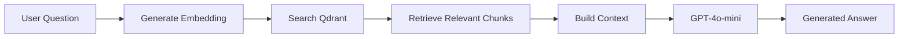

# Physical AI Textbook 🤖

An interactive educational platform for learning **Physical AI and Humanoid Robotics**, built for the Physical AI Hackathon 2025. Features a comprehensive 13-week curriculum with RAG-powered AI assistance, user authentication, adaptive learning, and multilingual support.


## 🚀 Live Demo

| Service | URL | Status |
|---------|-----|--------|
| **Frontend** | [edeveloper132.github.io/textbook-hackathon](https://edeveloper132.github.io/textbook-hackathon/) |  |
| **API** | [physical-ai-textbook-api.onrender.com](https://physical-ai-textbook-api.onrender.com) |  |
| **API Docs** | [Swagger UI](https://physical-ai-textbook-api.onrender.com/docs) | Interactive API documentation |

> ⏰ **Note**: The backend is hosted on Render's free tier, which spins down after 15 minutes of inactivity. The first request may take 30-60 seconds while the server wakes up.

---

## 📖 What is Physical AI?

Physical AI refers to artificial intelligence systems that interact with and operate in the physical world through robotic bodies. This textbook covers the complete stack from ROS2 fundamentals to cutting-edge Vision-Language-Action (VLA) models that enable robots to understand and execute natural language instructions.

### Target Audience
- 🎓 Robotics students and researchers
- 💻 Software engineers transitioning to robotics
- 🔬 AI practitioners interested in embodied AI
- 🏭 Industry professionals in automation

---

## 📚 Course Curriculum

A comprehensive 13-week journey from robotics fundamentals to advanced AI integration:

| Module | Topics | Weeks | Chapters |
|--------|--------|-------|----------|
| **1. ROS2 Foundations** | Nodes, Topics, Services, Actions, TF2, Nav2, MoveIt2 | 1-5 | 6 |
| **2. Simulation** | Gazebo Classic/Ignition, Unity Robotics Hub, Digital Twins | 6-7 | 3 |
| **3. NVIDIA Isaac** | Isaac Sim, Isaac ROS, Omniverse, Synthetic Data Generation | 8-10 | 4 |
| **4. VLA Models** | Vision-Language Models, Action Prediction, RT-2, OpenVLA | 11-13 | 5 |

### Chapter Overview

<details>
<summary><b>Module 1: ROS2 Foundations (Weeks 1-5)</b></summary>

1. **Introduction to ROS2** - Architecture, DDS, Quality of Service
2. **Nodes & Communication** - Publishers, Subscribers, Services, Actions
3. **TF2 Transforms** - Coordinate frames, Transform trees, Static/Dynamic TF
4. **Navigation Stack (Nav2)** - Path planning, Costmaps, Behavior trees
5. **Manipulation (MoveIt2)** - Motion planning, Kinematics, Grasping
6. **ROS2 Best Practices** - Launch files, Parameters, Lifecycle nodes

</details>

<details>
<summary><b>Module 2: Simulation (Weeks 6-7)</b></summary>

7. **Gazebo Simulation** - World building, Sensors, Physics engines
8. **Unity Robotics Hub** - High-fidelity rendering, ML-Agents integration
9. **Digital Twins** - Real-time synchronization, Industrial applications

</details>

<details>
<summary><b>Module 3: NVIDIA Isaac (Weeks 8-10)</b></summary>

10. **Isaac Sim Overview** - Omniverse platform, USD workflows
11. **Isaac ROS** - GPU-accelerated perception, NITROS
12. **Synthetic Data** - Domain randomization, Replicator, Training data generation
13. **Isaac Lab** - Reinforcement learning, Sim-to-real transfer

</details>

<details>
<summary><b>Module 4: VLA Models (Weeks 11-13)</b></summary>

14. **Vision-Language Models** - CLIP, LLaVA, multimodal understanding
15. **Action Prediction** - Behavior cloning, Diffusion policies
16. **RT-2 & PaLM-E** - Google's robotic transformers
17. **OpenVLA** - Open-source VLA implementation
18. **Deployment** - Edge inference, Real-time constraints

</details>

---

## ✨ Features

### 🎯 Core Features

| Feature | Description |
|---------|-------------|
| 📖 **Interactive Textbook** | 21 MDX chapters with syntax highlighting, Mermaid diagrams, and embedded code examples |
| 🤖 **RAG Chatbot** | Ask questions about any topic - AI searches the textbook and provides contextual answers |
| 🔍 **Selection Q&A** | Highlight any text and ask questions about it specifically |
| 🌙 **Dark Mode** | Full dark mode support for comfortable reading |
| 📱 **Responsive Design** | Works on desktop, tablet, and mobile devices |

### 🎁 Bonus Features

| Feature | Description |
|---------|-------------|
| 🔐 **Authentication** | Email/password registration + GitHub OAuth login |
| 📊 **Adaptive Quiz** | 10-question assessment to determine your experience level |
| 🎯 **Personalization** | Content automatically adapts based on your quiz results (Beginner/Intermediate/Advanced) |
| 🇵🇰 **Urdu Translation** | Translate any content to Urdu for accessibility |

### How RAG Works



1. User asks a question about robotics
2. Question is converted to a vector embedding
3. Qdrant finds the most relevant textbook sections
4. Context is built from matched content
5. GPT-4o-mini generates a comprehensive answer

---

## 🛠️ Tech Stack

### Frontend
| Technology | Purpose |
|------------|---------|
| [Docusaurus 3.x](https://docusaurus.io/) | Documentation framework |
| TypeScript | Type-safe development |
| MDX | Markdown with JSX components |
| Mermaid | Diagrams and flowcharts |
| React 18 | UI components |

### Backend
| Technology | Purpose |
|------------|---------|
| [FastAPI](https://fastapi.tiangolo.com/) | High-performance Python API |
| OpenAI GPT-4o-mini | LLM for Q&A and translation |
| [Qdrant Cloud](https://qdrant.tech/) | Vector database for RAG |
| SQLite + aiosqlite | User data storage |
| JWT + bcrypt | Authentication |

### Infrastructure
| Service | Purpose |
|---------|---------|
| GitHub Pages | Frontend hosting (free) |
| Render.com | Backend hosting (free tier) |
| GitHub Actions | CI/CD automation |

---

## 🏃 Quick Start

### Prerequisites

- Node.js 18+ and npm
- Python 3.11+
- OpenAI API key
- Qdrant Cloud account (free tier)

### Frontend Setup

```bash
# Clone the repository
git clone https://github.com/eDeveloper132/textbook-hackathon.git
cd textbook-hackathon/physical-ai-textbook

# Install dependencies
npm install

# Start development server
npm start
```

Visit `http://localhost:3000/textbook-hackathon/` in your browser.

### Backend Setup

```bash
# Navigate to backend
cd physical-ai-textbook/backend

# Create virtual environment (recommended)
python -m venv venv
source venv/bin/activate  # On Windows: venv\Scripts\activate

# Install dependencies
pip install -r requirements.txt

# Setup environment variables
cp .env.example .env
# Edit .env with your API keys (see below)

# Run development server
uvicorn app.main:app --reload
```

API available at `http://localhost:8000` with interactive docs at `/docs`.

### Index Textbook Content

Before the RAG chatbot can answer questions, you need to index the content:

```bash
cd physical-ai-textbook/backend
python scripts/index_content.py
```

This will:
1. Parse all MDX files from `../docs/`
2. Split content into chunks
3. Generate embeddings using OpenAI
4. Upload vectors to Qdrant

---

## 🔧 Environment Variables

### Frontend (`physical-ai-textbook/.env`)

```env
# Backend API URL
REACT_APP_BACKEND_URL=https://physical-ai-textbook-api.onrender.com

# Feature Flags (set to 'true' to enable)
REACT_APP_FEATURE_AUTH=true
REACT_APP_FEATURE_QUIZ=true
REACT_APP_FEATURE_PERSONALIZATION=true
REACT_APP_FEATURE_URDU=true
```

### Backend (`physical-ai-textbook/backend/.env`)

```env
# Required - OpenAI for embeddings and chat
OPENAI_API_KEY=sk-proj-...

# Required - Qdrant for vector search
QDRANT_URL=https://your-cluster-id.region.cloud.qdrant.io:6333
QDRANT_API_KEY=your-qdrant-api-key

# Required - JWT for authentication
JWT_SECRET=your-random-secret-key-min-32-chars

# Optional - GitHub OAuth
GITHUB_CLIENT_ID=your-github-oauth-client-id
GITHUB_CLIENT_SECRET=your-github-oauth-client-secret

# Optional - Frontend URL for OAuth callback
FRONTEND_URL=http://localhost:3000/textbook-hackathon
```

> ⚠️ **Security**: Never commit `.env` files! They should be in `.gitignore`.

---

## 📁 Project Structure

```
textbook-hackathon/
├── physical-ai-textbook/
│   ├── docs/                      # 📖 MDX content (21 chapters)
│   │   ├── intro.mdx              # Course introduction
│   │   ├── module-1-ros2/         # ROS2 chapters (6 files)
│   │   ├── module-2-simulation/   # Simulation chapters (3 files)
│   │   ├── module-3-isaac/        # NVIDIA Isaac chapters (4 files)
│   │   └── module-4-vla/          # VLA chapters (5 files)
│   │
│   ├── src/
│   │   ├── components/            # React components
│   │   │   ├── AuthGuard.tsx      # Authentication wrapper
│   │   │   ├── ChatbotIframe.tsx  # Embedded chatbot
│   │   │   ├── FeatureToolbar.tsx # Quiz/Translate/Personalize
│   │   │   ├── PersonalizeButton.tsx
│   │   │   └── UrduButton.tsx
│   │   ├── css/                   # Custom styles
│   │   ├── theme/                 # Docusaurus theme overrides
│   │   └── utils/
│   │       └── featureFlags.ts    # Feature toggle logic
│   │
│   ├── static/                    # Static assets (images, icons)
│   ├── docusaurus.config.ts       # Site configuration
│   ├── sidebars.ts                # Navigation structure
│   ├── package.json
│   └── tsconfig.json
│   │
│   └── backend/
│       ├── app/
│       │   ├── main.py            # FastAPI routes & CORS
│       │   ├── auth.py            # JWT + GitHub OAuth
│       │   ├── db.py              # SQLite async database
│       │   ├── rag.py             # RAG engine (OpenAI + Qdrant)
│       │   ├── quiz.py            # Quiz questions & scoring
│       │   ├── personalization.py # Content adaptation
│       │   └── translation.py     # Urdu translation
│       ├── data/                  # SQLite database files
│       ├── scripts/
│       │   └── index_content.py   # Index docs to Qdrant
│       ├── tests/                 # pytest test suite
│       ├── requirements.txt
│       ├── Dockerfile
│       └── render.yaml
│
├── .github/
│   └── workflows/
│       └── deploy.yml             # GitHub Actions CI/CD
│
├── render.yaml                    # Render.com deployment config
└── README.md                      # This file
```

---

## 📊 API Reference

### Health & Info

| Endpoint | Method | Description |
|----------|--------|-------------|
| `/` | GET | API info and links |
| `/api/health` | GET | Health check for monitoring |

### RAG Q&A

| Endpoint | Method | Auth | Description |
|----------|--------|------|-------------|
| `/api/ask` | POST | ❌ | Ask question about textbook content |
| `/api/ask-selection` | POST | ❌ | Ask about specific selected text |

**Request Body:**
```json
{
  "question": "What is ROS2?",
  "selection": "optional selected text"
}
```

### Authentication

| Endpoint | Method | Description |
|----------|--------|-------------|
| `/api/auth/register` | POST | Register with email/password |
| `/api/auth/login` | POST | Login and get JWT token |
| `/api/auth/me` | GET | Get current user info (requires token) |
| `/api/auth/github` | GET | Redirect to GitHub OAuth |
| `/api/auth/github/callback` | GET | Handle GitHub OAuth callback |

### Quiz System

| Endpoint | Method | Auth | Description |
|----------|--------|------|-------------|
| `/api/quiz/questions` | GET | ❌ | Get 10 assessment questions |
| `/api/quiz/submit` | POST | ✅ | Submit answers, get level |
| `/api/quiz/results` | GET | ✅ | Get user's quiz history |

### Personalization & Translation

| Endpoint | Method | Auth | Description |
|----------|--------|------|-------------|
| `/api/personalize` | POST | ✅ | Adapt content to user level |
| `/api/translate` | POST | ❌ | Translate text to Urdu |

---

## 🧪 Testing

### Backend Tests

```bash
cd physical-ai-textbook/backend
pytest -v
```

### Frontend Build Test

```bash
cd physical-ai-textbook
npm run build
```

### API Health Check

```bash
curl https://physical-ai-textbook-api.onrender.com/api/health
# Expected: {"status":"ok","service":"physical-ai-textbook-api"}
```

---

## 🚀 Deployment

### Frontend (GitHub Pages)

The frontend automatically deploys when you push to `main` branch:

1. GitHub Actions runs `npm run build`
2. Built files are deployed to `gh-pages` branch
3. Available at `https://yourusername.github.io/textbook-hackathon/`

### Backend (Render.com)

1. Connect your GitHub repository to Render
2. Create a new Web Service
3. Set the following:
   - **Root Directory**: `physical-ai-textbook/backend`
   - **Build Command**: `pip install -r requirements.txt`
   - **Start Command**: `uvicorn app.main:app --host 0.0.0.0 --port $PORT`
4. Add environment variables in Render dashboard
5. Deploy!

The `render.yaml` in the root directory can also be used for Blueprint deploys.

---

## 🤝 Contributing

Contributions are welcome! Please:

1. Fork the repository
2. Create a feature branch (`git checkout -b feature/amazing-feature`)
3. Commit your changes (`git commit -m 'Add amazing feature'`)
4. Push to the branch (`git push origin feature/amazing-feature`)
5. Open a Pull Request

---

## 📄 License

This project is licensed under the MIT License - see the [LICENSE](LICENSE) file for details.

---

## 🙏 Acknowledgments

- [Docusaurus](https://docusaurus.io/) - Amazing documentation framework
- [FastAPI](https://fastapi.tiangolo.com/) - Modern Python web framework
- [OpenAI](https://openai.com/) - GPT-4o-mini for AI capabilities
- [Qdrant](https://qdrant.tech/) - Vector database for RAG
- Physical AI Hackathon organizers

---

## 📬 Contact

- **GitHub**: [@eDeveloper132](https://github.com/eDeveloper132)
- **Project Link**: [github.com/eDeveloper132/textbook-hackathon](https://github.com/eDeveloper132/textbook-hackathon)

---

<div align="center">

**Built with ❤️ for the Physical AI Hackathon 2025** 🤖

[Live Demo](https://edeveloper132.github.io/textbook-hackathon/) · [API Docs](https://physical-ai-textbook-api.onrender.com/docs) · [Report Bug](https://github.com/eDeveloper132/textbook-hackathon/issues)

</div>
