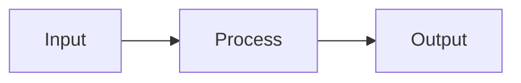

# 📖 Documentation Content

This directory contains all the MDX content for the Physical AI Textbook.

## 📁 Structure

```
docs/
├── intro.mdx                 # Course introduction & overview
├── why-physical-ai.mdx       # Motivation for Physical AI
├── about-author.mdx          # Author information
├── learning-outcomes.mdx     # Course learning objectives
├── assessments.mdx           # Assessment criteria
│
├── module-1-ros2/            # Weeks 1-5: ROS2 Foundations
│   ├── 01-introduction.mdx
│   ├── 02-nodes-topics.mdx
│   ├── 03-services-actions.mdx
│   ├── 04-tf2-transforms.mdx
│   ├── 05-nav2-navigation.mdx
│   └── 06-moveit2.mdx
│
├── module-2-simulation/      # Weeks 6-7: Simulation
│   ├── 07-gazebo.mdx
│   ├── 08-unity-robotics.mdx
│   └── 09-digital-twins.mdx
│
├── module-3-isaac/           # Weeks 8-10: NVIDIA Isaac
│   ├── 10-isaac-sim.mdx
│   ├── 11-isaac-ros.mdx
│   ├── 12-synthetic-data.mdx
│   └── 13-isaac-lab.mdx
│
└── module-4-vla/             # Weeks 11-13: VLA Models
    ├── 14-vision-language.mdx
    ├── 15-action-prediction.mdx
    ├── 16-rt2-palme.mdx
    ├── 17-openvla.mdx
    └── 18-deployment.mdx
```

## 📝 Content Format

All content is written in **MDX** (Markdown + JSX), allowing:

- Standard Markdown syntax
- React component embedding
- Mermaid diagrams
- Code blocks with syntax highlighting
- Docusaurus admonitions (tips, warnings, etc.)

### Example MDX Features

```mdx
# Chapter Title

Introduction paragraph...

:::tip Pro Tip
Helpful information here
:::

:::warning
Important warning message
:::

```python
# Code with syntax highlighting
import rclpy
from rclpy.node import Node
```



<CustomComponent prop="value" />
```

## 🔧 Adding New Content

1. Create a new `.mdx` file in the appropriate module folder
2. Add frontmatter at the top:

```yaml
---
sidebar_position: 1
title: "Chapter Title"
description: "Brief description for SEO"
---
```

3. Update `sidebars.ts` if needed for navigation
4. Run `npm start` to preview changes

## 📊 Content Guidelines

- **Target length**: 1500-3000 words per chapter
- **Include**: Code examples, diagrams, exercises
- **Use**: Clear headings (H2, H3) for structure
- **Add**: Key takeaways at the end of each chapter
- **Link**: Related chapters and external resources

## 🌐 Internationalization

Content is currently in English. Urdu translations are available via the API's `/api/translate` endpoint for runtime translation.

---

Part of the [Physical AI Textbook](../README.md) project
