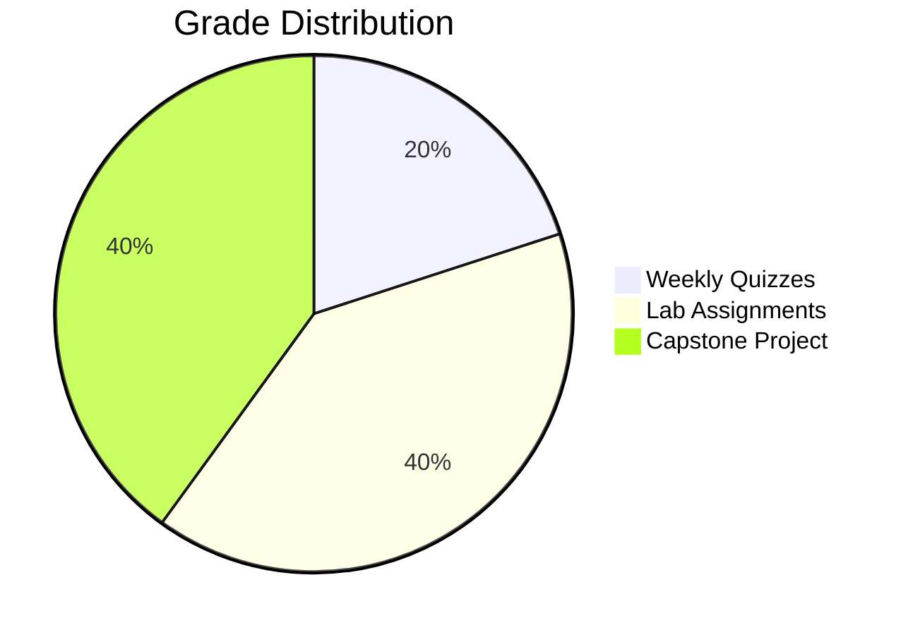

# Assessments & Grading

This page outlines how your work will be evaluated throughout the course.

## Grade Distribution



## Weekly Quizzes (20%)

- **Format**: 10 multiple-choice questions
- **Duration**: 15 minutes
- **Frequency**: End of each week
- **Topics**: Previous week's material

### Sample Quiz Question

> **Q: In ROS2, which QoS setting should you use for sensor data that can tolerate some message loss?**
> 
> A) Reliable, Transient Local  
> B) Best Effort, Volatile ✓  
> C) Reliable, Volatile  
> D) Best Effort, Transient Local

## Lab Assignments (40%)

| Lab | Module | Topic | Points |
|-----|--------|-------|--------|
| Lab 1 | M1 | Create a ROS2 Publisher/Subscriber | 50 |
| Lab 2 | M1 | Implement a Service Server | 50 |
| Lab 3 | M1 | Build a URDF Robot Model | 50 |
| Lab 4 | M1 | Configure Nav2 Navigation | 50 |
| Lab 5 | M2 | Gazebo World Creation | 50 |
| Lab 6 | M2 | Unity-ROS2 Integration | 50 |
| Lab 7 | M3 | Isaac Sim Robot Setup | 50 |
| Lab 8 | M3 | Synthetic Data Pipeline | 50 |
| Lab 9 | M4 | VLA Model Fine-tuning | 50 |
| Lab 10 | M4 | Robot Deployment | 50 |

**Total: 500 points → Normalized to 40%**

### Lab Grading Rubric

| Criterion | Excellent (90-100%) | Good (70-89%) | Needs Work (below 70%) |
|-----------|---------------------|---------------|-------------------|
| Functionality | Works perfectly | Minor issues | Major issues |
| Code Quality | Clean, documented | Some issues | Poor quality |
| Understanding | Deep insight | Basic grasp | Confusion evident |

## Capstone Project (40%)

### Project Options

1. **Autonomous Mobile Robot** — Navigation + manipulation
2. **Humanoid Motion Control** — Walking + gesture recognition
3. **Sim-to-Real Transfer** — Train in Isaac, deploy on hardware

### Capstone Rubric

```python
capstone_rubric = {
    "Technical Implementation": {
        "weight": 40,
        "criteria": [
            "System architecture",
            "Code quality",
            "Integration completeness"
        ]
    },
    "Documentation": {
        "weight": 20,
        "criteria": [
            "README clarity",
            "API documentation",
            "Setup instructions"
        ]
    },
    "Demonstration": {
        "weight": 25,
        "criteria": [
            "Working demo",
            "Edge case handling",
            "Performance metrics"
        ]
    },
    "Presentation": {
        "weight": 15,
        "criteria": [
            "Clear explanation",
            "Technical depth",
            "Q&A handling"
        ]
    }
}

total = sum(c["weight"] for c in capstone_rubric.values())
print(f"Total weight: {total}%")  # 100%
```

### Timeline

| Week | Milestone | Deliverable |
|------|-----------|-------------|
| 10 | Proposal | 1-page project description |
| 12 | Progress | Working prototype demo |
| 13 | Final | Complete system + presentation |

## Academic Integrity

- All work must be your own
- Cite external resources
- Collaboration allowed on concepts, not code
- AI assistants (like this chatbot!) are allowed for learning

## Late Policy

- Labs: -10% per day, max 3 days
- Capstone: No late submissions accepted
- Quizzes: Must be completed on time

## Getting Help

1. **Course Chatbot** — Ask questions anytime! 🤖
2. **Office Hours** — Weekly live sessions
3. **Discussion Forum** — Peer support
4. **Email** — For private concerns

**Good luck with your assessments!** 📚
