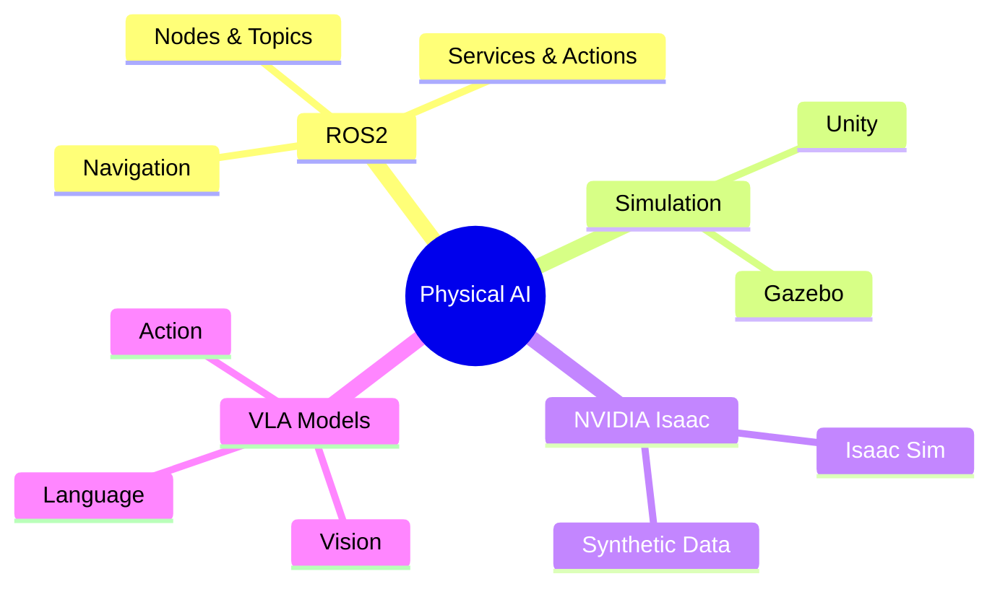

# Physical AI & Humanoid Robotics

> **Bridging Digital Brains and Physical Bodies**

Welcome to this comprehensive course on Physical AI and Humanoid Robotics. Over the next 13 weeks, you'll learn how to build intelligent robots that can perceive, reason, and act in the physical world.

## What You'll Learn



## Course Structure

| Module | Weeks | Focus |
|--------|-------|-------|
| **Module 1** | 1-5 | ROS2 Foundations |
| **Module 2** | 6-7 | Simulation (Gazebo/Unity) |
| **Module 3** | 8-10 | NVIDIA Isaac Platform |
| **Module 4** | 11-13 | Vision-Language-Action Models |

## Prerequisites

- Basic Python programming
- Linux command line familiarity
- Basic linear algebra and calculus
- Enthusiasm for robotics! 🤖

## Getting Started

1. Set up your development environment
2. Install ROS2 Humble
3. Clone the course repository
4. Join our community Discord

```bash
# Quick start
sudo apt update
sudo apt install ros-humble-desktop
source /opt/ros/humble/setup.bash
```

## Let's Build the Future Together

Physical AI is transforming industries from manufacturing to healthcare. By the end of this course, you'll have the skills to build robots that can:

- Navigate complex environments autonomously
- Manipulate objects with precision
- Understand and respond to natural language commands
- Learn from demonstration and adapt to new tasks

**Ready to begin? Let's go!** 🚀
