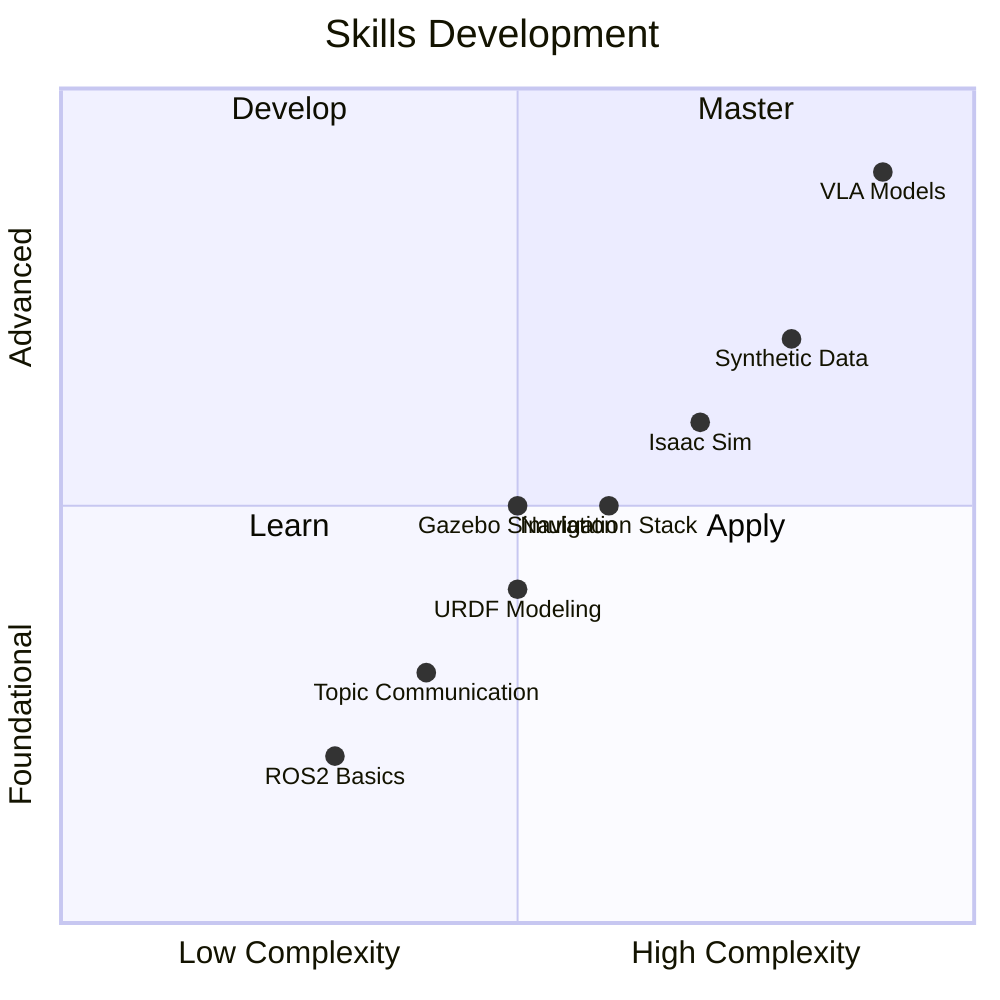

# Learning Outcomes

By completing this course, you will develop expertise across multiple domains of Physical AI and Robotics.

## Skills Matrix



## Module-by-Module Outcomes

### Module 1: ROS2 Foundations (Weeks 1-5)

After completing this module, you will be able to:

- [ ] Create and manage ROS2 nodes in Python and C++
- [ ] Design topic-based communication architectures
- [ ] Implement services and actions for robot control
- [ ] Write launch files with parameterization
- [ ] Work with TF2 transforms and URDF models
- [ ] Configure and use the Nav2 navigation stack

### Module 2: Simulation (Weeks 6-7)

After completing this module, you will be able to:

- [ ] Build robot models in Gazebo/Ignition
- [ ] Create simulation worlds with physics
- [ ] Integrate ROS2 with Unity Robotics Hub
- [ ] Test robot algorithms in simulation before deployment

### Module 3: NVIDIA Isaac (Weeks 8-10)

After completing this module, you will be able to:

- [ ] Set up Isaac Sim for robot development
- [ ] Use Isaac ROS packages for perception
- [ ] Generate synthetic training data
- [ ] Perform domain randomization for sim-to-real transfer

### Module 4: VLA Models (Weeks 11-13)

After completing this module, you will be able to:

- [ ] Understand Vision-Language-Action architectures
- [ ] Fine-tune foundation models for robotics tasks
- [ ] Deploy VLA models on robot hardware
- [ ] Build end-to-end Physical AI systems

## Competency Levels

| Level | Description | Assessment |
|-------|-------------|------------|
| **Beginner** | Can follow tutorials | Weekly quizzes |
| **Intermediate** | Can modify existing code | Lab assignments |
| **Advanced** | Can design new solutions | Capstone project |

## Industry Alignment

These outcomes align with industry requirements for:

- Robotics Software Engineer
- AI/ML Engineer (Robotics)
- Simulation Engineer
- Research Scientist

## Assessment Methods

1. **Weekly Quizzes** (20%) — Test conceptual understanding
2. **Lab Assignments** (40%) — Hands-on implementation
3. **Capstone Project** (40%) — End-to-end system development

## Your Learning Path

```python
def your_journey():
    skills = []
    
    # Module 1: Foundation
    skills.extend(['ros2_basics', 'node_programming', 'navigation'])
    
    # Module 2: Simulation
    skills.extend(['gazebo', 'unity_robotics'])
    
    # Module 3: Isaac
    skills.extend(['isaac_sim', 'synthetic_data'])
    
    # Module 4: VLA
    skills.extend(['foundation_models', 'deployment'])
    
    return f"You've mastered {len(skills)} key skills!"

print(your_journey())
# Output: You've mastered 9 key skills!
```

**Track your progress and celebrate each milestone!** 🎯
