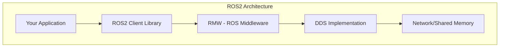

# Module 1: ROS2 Foundations

Welcome to Module 1! Over the next 5 weeks, you'll master ROS2 (Robot Operating System 2), the industry-standard middleware for robotics.

## What is ROS2?

ROS2 is not an operating system—it's a **middleware framework** that provides:

- Communication infrastructure (topics, services, actions)
- Hardware abstraction
- Package management
- Development tools



## Why ROS2 over ROS1?

| Feature | ROS1 | ROS2 |
|---------|------|------|
| Real-time | ❌ | ✅ |
| Security | ❌ | ✅ (DDS-Security) |
| Multi-robot | Limited | ✅ Native |
| Windows | ❌ | ✅ |
| Lifecycle | ❌ | ✅ Managed nodes |

## Installation

### Ubuntu 22.04 (Recommended)

```bash
# Set locale
sudo apt update && sudo apt install locales
sudo locale-gen en_US en_US.UTF-8
sudo update-locale LC_ALL=en_US.UTF-8 LANG=en_US.UTF-8

# Add ROS2 repository
sudo apt install software-properties-common
sudo add-apt-repository universe
sudo apt update && sudo apt install curl -y
sudo curl -sSL https://raw.githubusercontent.com/ros/rosdistro/master/ros.key -o /usr/share/keyrings/ros-archive-keyring.gpg
echo "deb [arch=$(dpkg --print-architecture) signed-by=/usr/share/keyrings/ros-archive-keyring.gpg] http://packages.ros.org/ros2/ubuntu $(. /etc/os-release && echo $UBUNTU_CODENAME) main" | sudo tee /etc/apt/sources.list.d/ros2.list > /dev/null

# Install ROS2 Humble
sudo apt update
sudo apt install ros-humble-desktop

# Source setup
echo "source /opt/ros/humble/setup.bash" >> ~/.bashrc
source ~/.bashrc
```

### Verify Installation

```bash
# Terminal 1: Run talker
ros2 run demo_nodes_cpp talker

# Terminal 2: Run listener
ros2 run demo_nodes_cpp listener
```

You should see messages being exchanged! 🎉

## Module Roadmap

| Week | Topic | Key Concepts |
|------|-------|--------------|
| 1 | Architecture | Nodes, Executors, DDS |
| 2 | Communication | Topics, Services, Actions |
| 3 | Configuration | Launch files, Parameters |
| 4 | Transforms | TF2, URDF |
| 5 | Navigation | Nav2 Stack |

## Your First ROS2 Node

```python
#!/usr/bin/env python3
import rclpy
from rclpy.node import Node

class HelloROS2(Node):
    def __init__(self):
        super().__init__('hello_ros2')
        self.get_logger().info('Hello, ROS2! 🤖')

def main():
    rclpy.init()
    node = HelloROS2()
    rclpy.spin(node)
    node.destroy_node()
    rclpy.shutdown()

if __name__ == '__main__':
    main()
```

## Learning Resources

- [ROS2 Official Documentation](https://docs.ros.org/en/humble/)
- [ROS2 Tutorials](https://docs.ros.org/en/humble/Tutorials.html)
- [The Robotics Back-End](https://roboticsbackend.com/)

## Let's Begin!

In **Week 1**, we'll dive deep into ROS2 architecture—understanding nodes, executors, and the DDS communication layer.

**Ready? Let's build robots!** 🚀
