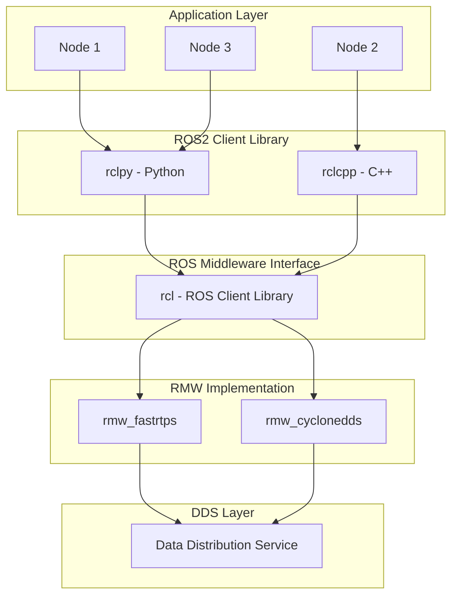
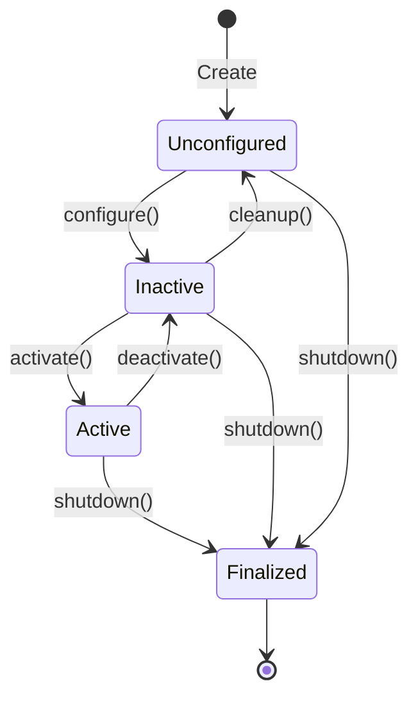

# Week 1: ROS2 Architecture

This week we dive deep into the core architecture of ROS2, understanding how its components work together.

## Learning Objectives

By the end of this week, you will:
- Understand ROS2's layered architecture
- Create and manage nodes
- Configure executors for different use cases
- Understand DDS and QoS settings

## ROS2 Architecture Overview



## Nodes: The Building Blocks

A **node** is a single-purpose executable that communicates with other nodes.

### Creating a Node in Python

```python
#!/usr/bin/env python3
import rclpy
from rclpy.node import Node

class MyRobotNode(Node):
    def __init__(self):
        super().__init__('my_robot_node')
        
        # Create a timer that fires every 1 second
        self.timer = self.create_timer(1.0, self.timer_callback)
        self.counter = 0
        
        self.get_logger().info('Node initialized!')
    
    def timer_callback(self):
        self.counter += 1
        self.get_logger().info(f'Timer fired: {self.counter}')

def main(args=None):
    rclpy.init(args=args)
    node = MyRobotNode()
    
    try:
        rclpy.spin(node)
    except KeyboardInterrupt:
        pass
    finally:
        node.destroy_node()
        rclpy.shutdown()

if __name__ == '__main__':
    main()
```

### Node Lifecycle



## Executors

Executors manage how callbacks are processed.

### Single-Threaded Executor (Default)

```python
import rclpy
from rclpy.executors import SingleThreadedExecutor

rclpy.init()
node = MyRobotNode()
executor = SingleThreadedExecutor()
executor.add_node(node)

try:
    executor.spin()
finally:
    executor.shutdown()
    node.destroy_node()
    rclpy.shutdown()
```

### Multi-Threaded Executor

```python
from rclpy.executors import MultiThreadedExecutor

executor = MultiThreadedExecutor(num_threads=4)
executor.add_node(node1)
executor.add_node(node2)
executor.spin()
```

## DDS and Quality of Service (QoS)

DDS (Data Distribution Service) is the communication standard underlying ROS2.

### QoS Profiles

| Profile | Reliability | Durability | Use Case |
|---------|-------------|------------|----------|
| Sensor Data | Best Effort | Volatile | Camera, LiDAR |
| Parameters | Reliable | Transient Local | Configuration |
| Services | Reliable | Volatile | Request/Response |
| Default | Reliable | Volatile | General use |

### Configuring QoS

```python
from rclpy.qos import QoSProfile, ReliabilityPolicy, DurabilityPolicy

sensor_qos = QoSProfile(
    reliability=ReliabilityPolicy.BEST_EFFORT,
    durability=DurabilityPolicy.VOLATILE,
    depth=10
)

self.subscription = self.create_subscription(
    Image,
    'camera/image',
    self.image_callback,
    sensor_qos
)
```

## Hands-On Exercise

### Exercise 1: Create a Robot Status Node

Create a node that:
1. Publishes robot status every 500ms
2. Uses appropriate QoS settings
3. Logs status changes

### Exercise 2: Multi-Node System

Create two nodes:
1. A sensor simulator node
2. A data processor node

Have them communicate via a topic.

## Key Takeaways

1. **Nodes** are single-purpose executables
2. **Executors** control callback processing
3. **DDS** provides reliable, real-time communication
4. **QoS** settings must match between publisher and subscriber

## Next Week

In Week 2, we'll explore **Topics, Services, and Actions** — the three communication paradigms in ROS2.
