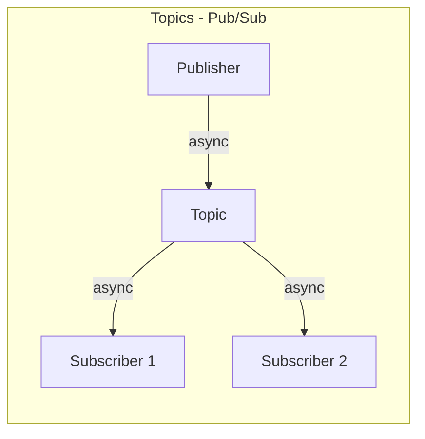
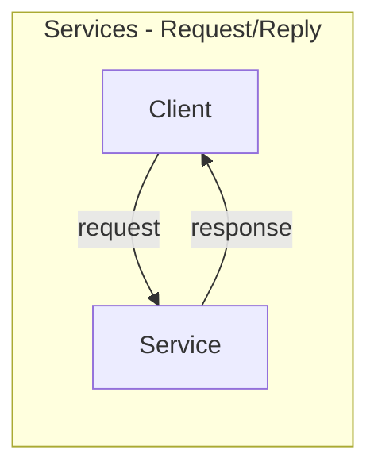

# Week 2: Topics, Services & Actions

This week covers the three fundamental communication patterns in ROS2.

## Communication Paradigms





## Topics

Topics enable **asynchronous**, **many-to-many** communication.

### Publisher Example

```python
from std_msgs.msg import String

class MinimalPublisher(Node):
    def __init__(self):
        super().__init__('minimal_publisher')
        self.publisher_ = self.create_publisher(String, 'topic', 10)
        self.timer = self.create_timer(0.5, self.timer_callback)
        self.i = 0

    def timer_callback(self):
        msg = String()
        msg.data = f'Hello World: {self.i}'
        self.publisher_.publish(msg)
        self.get_logger().info(f'Publishing: "{msg.data}"')
        self.i += 1
```

### Subscriber Example

```python
class MinimalSubscriber(Node):
    def __init__(self):
        super().__init__('minimal_subscriber')
        self.subscription = self.create_subscription(
            String,
            'topic',
            self.listener_callback,
            10)

    def listener_callback(self, msg):
        self.get_logger().info(f'I heard: "{msg.data}"')
```

## Services

Services enable **synchronous**, **one-to-one** communication.

### Service Definition (`.srv` file)

```
# AddTwoInts.srv
int64 a
int64 b
---
int64 sum
```

### Service Server

```python
from example_interfaces.srv import AddTwoInts

class AddTwoIntsServer(Node):
    def __init__(self):
        super().__init__('add_two_ints_server')
        self.srv = self.create_service(
            AddTwoInts, 
            'add_two_ints', 
            self.add_callback)

    def add_callback(self, request, response):
        response.sum = request.a + request.b
        self.get_logger().info(f'{request.a} + {request.b} = {response.sum}')
        return response
```

### Service Client

```python
class AddTwoIntsClient(Node):
    def __init__(self):
        super().__init__('add_two_ints_client')
        self.cli = self.create_client(AddTwoInts, 'add_two_ints')
        while not self.cli.wait_for_service(timeout_sec=1.0):
            self.get_logger().info('Waiting for service...')

    def send_request(self, a, b):
        request = AddTwoInts.Request()
        request.a = a
        request.b = b
        future = self.cli.call_async(request)
        return future
```

## Actions

Actions are for **long-running tasks** with feedback.

### Action Definition (`.action` file)

```
# Fibonacci.action
# Goal
int32 order
---
# Result
int32[] sequence
---
# Feedback
int32[] partial_sequence
```

### When to Use What?

| Pattern | Use When | Examples |
|---------|----------|----------|
| **Topics** | Continuous data streams | Sensor data, odometry |
| **Services** | Quick request/response | Get parameter, trigger action |
| **Actions** | Long-running with feedback | Navigation, manipulation |

## Hands-On Exercise

Create a robot control system with:
1. A `/cmd_vel` topic for velocity commands
2. A `/get_status` service for robot state
3. A `/navigate_to_pose` action for navigation

## Key Takeaways

1. **Topics** = async, many-to-many (sensor data)
2. **Services** = sync, one-to-one (quick queries)
3. **Actions** = async, one-to-one with feedback (long tasks)
