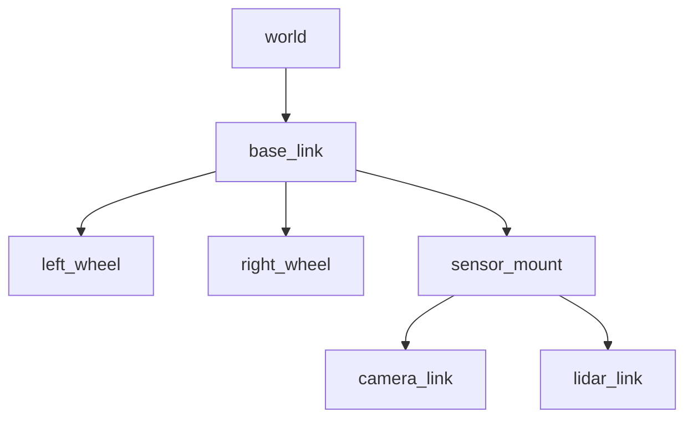

# Week 4: TF2 & URDF

Understanding spatial relationships between robot parts and the world.

## TF2: Transform Library

TF2 tracks coordinate frames over time.



### Broadcasting Transforms

```python
from tf2_ros import TransformBroadcaster
from geometry_msgs.msg import TransformStamped

class FramePublisher(Node):
    def __init__(self):
        super().__init__('frame_publisher')
        self.br = TransformBroadcaster(self)
        self.timer = self.create_timer(0.1, self.broadcast_timer_callback)

    def broadcast_timer_callback(self):
        t = TransformStamped()
        t.header.stamp = self.get_clock().now().to_msg()
        t.header.frame_id = 'world'
        t.child_frame_id = 'base_link'
        
        t.transform.translation.x = 1.0
        t.transform.translation.y = 2.0
        t.transform.translation.z = 0.0
        
        t.transform.rotation.w = 1.0
        
        self.br.sendTransform(t)
```

## URDF: Robot Description

URDF (Unified Robot Description Format) defines robot structure.

### Basic URDF Structure

```xml
<?xml version="1.0"?>
<robot name="my_robot">
  
  <!-- Base Link -->
  <link name="base_link">
    <visual>
      <geometry>
        <box size="0.5 0.3 0.1"/>
      </geometry>
    </visual>
  </link>
  
  <!-- Wheel -->
  <link name="left_wheel">
    <visual>
      <geometry>
        <cylinder length="0.05" radius="0.1"/>
      </geometry>
    </visual>
  </link>
  
  <!-- Joint -->
  <joint name="left_wheel_joint" type="continuous">
    <parent link="base_link"/>
    <child link="left_wheel"/>
    <origin xyz="0.2 0.2 0" rpy="1.5708 0 0"/>
    <axis xyz="0 0 1"/>
  </joint>
  
</robot>
```

### Joint Types

| Type | Motion | Use Case |
|------|--------|----------|
| `fixed` | None | Sensor mounts |
| `continuous` | Unlimited rotation | Wheels |
| `revolute` | Limited rotation | Arms |
| `prismatic` | Linear | Linear actuators |

## Key Takeaways

1. **TF2** manages coordinate frame relationships
2. **URDF** describes robot physical structure
3. **Xacro** enables reusable robot descriptions
4. **robot_state_publisher** broadcasts transforms from URDF
