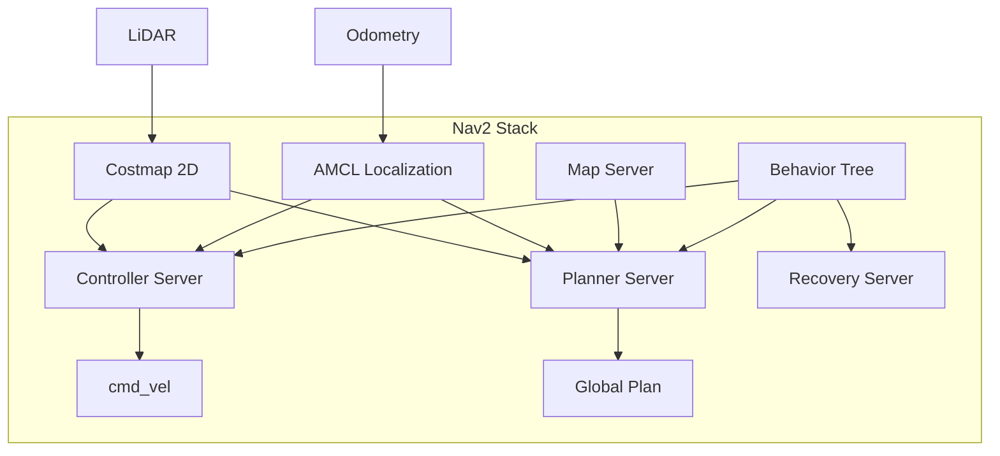

# Week 5: Nav2 Navigation Stack

Learn to make robots navigate autonomously using the Nav2 stack.

## Nav2 Architecture



## Setting Up Nav2

### Installation

```bash
sudo apt install ros-humble-navigation2 ros-humble-nav2-bringup
```

### Basic Launch

```bash
# Launch Nav2 with Turtlebot3
export TURTLEBOT3_MODEL=burger
ros2 launch nav2_bringup tb3_simulation_launch.py
```

## Sending Navigation Goals

### Using Action Client

```python
from nav2_simple_commander.robot_navigator import BasicNavigator
from geometry_msgs.msg import PoseStamped

navigator = BasicNavigator()

# Wait for Nav2 to be active
navigator.waitUntilNav2Active()

# Create goal pose
goal_pose = PoseStamped()
goal_pose.header.frame_id = 'map'
goal_pose.header.stamp = navigator.get_clock().now().to_msg()
goal_pose.pose.position.x = 2.0
goal_pose.pose.position.y = 1.0
goal_pose.pose.orientation.w = 1.0

# Navigate
navigator.goToPose(goal_pose)

# Wait for result
while not navigator.isTaskComplete():
    feedback = navigator.getFeedback()
    print(f'Distance remaining: {feedback.distance_remaining:.2f}')

result = navigator.getResult()
print(f'Navigation result: {result}')
```

## Key Takeaways

1. **Nav2** provides full autonomous navigation
2. **Costmaps** represent navigable space
3. **Planners** compute global paths
4. **Controllers** execute local motion
5. **Behavior trees** coordinate navigation logic
