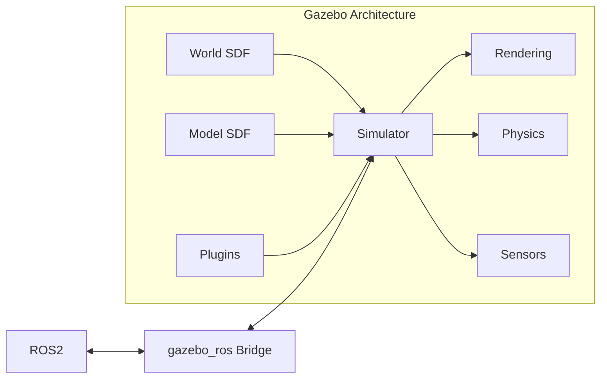

# Week 6: Gazebo Classic & Ignition

Learn to simulate robots in physically accurate environments.

## Gazebo Overview



## Creating a World

```xml
<?xml version="1.0" ?>
<sdf version="1.8">
  <world name="robot_world">
    
    <!-- Lighting -->
    <light type="directional" name="sun">
      <cast_shadows>true</cast_shadows>
      <pose>0 0 10 0 0 0</pose>
      <diffuse>0.8 0.8 0.8 1</diffuse>
    </light>
    
    <!-- Ground Plane -->
    <model name="ground_plane">
      <static>true</static>
      <link name="link">
        <collision name="collision">
          <geometry>
            <plane>
              <normal>0 0 1</normal>
              <size>100 100</size>
            </plane>
          </geometry>
        </collision>
      </link>
    </model>
    
  </world>
</sdf>
```

## Adding Sensors

### LiDAR Sensor

```xml
<sensor name="lidar" type="ray">
  <pose>0 0 0.2 0 0 0</pose>
  <ray>
    <scan>
      <horizontal>
        <samples>360</samples>
        <resolution>1</resolution>
        <min_angle>-3.14159</min_angle>
        <max_angle>3.14159</max_angle>
      </horizontal>
    </scan>
    <range>
      <min>0.1</min>
      <max>10.0</max>
    </range>
  </ray>
  <plugin name="laser" filename="libgazebo_ros_ray_sensor.so">
    <ros>
      <remapping>~/out:=scan</remapping>
    </ros>
    <output_type>sensor_msgs/LaserScan</output_type>
  </plugin>
</sensor>
```

## Key Takeaways

1. **SDF** defines worlds and models
2. **Plugins** connect Gazebo to ROS2
3. **Sensors** simulate real sensor data
4. **Physics engines** provide accurate dynamics
