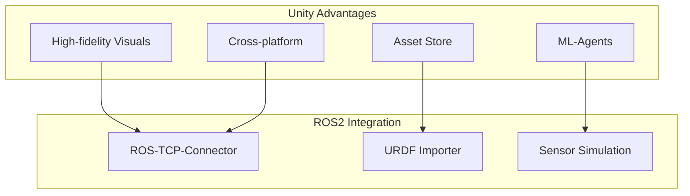

# Week 7: Unity Robotics Hub

Integrate ROS2 with Unity for advanced visualization and simulation.

## Why Unity for Robotics?



## Setup

### Installing ROS-TCP-Connector

```bash
# In your ROS2 workspace
cd ~/ros2_ws/src
git clone https://github.com/Unity-Technologies/ROS-TCP-Endpoint.git
cd ..
colcon build
```

### Unity Package Manager

1. Open Unity Package Manager
2. Add package from git URL:
   ```
   https://github.com/Unity-Technologies/ROS-TCP-Connector.git?path=/com.unity.robotics.ros-tcp-connector
   ```

## URDF Import

```csharp
// Import URDF in Unity
using Unity.Robotics.UrdfImporter;

public class RobotLoader : MonoBehaviour
{
    void Start()
    {
        // Load URDF file
        var robot = UrdfRobotExtensions.Create(
            "Assets/Robots/my_robot.urdf"
        );
    }
}
```

## Publishing from Unity

```csharp
using Unity.Robotics.ROSTCPConnector;
using RosMessageTypes.Geometry;

public class VelocityPublisher : MonoBehaviour
{
    ROSConnection ros;
    public string topicName = "cmd_vel";
    
    void Start()
    {
        ros = ROSConnection.GetOrCreateInstance();
        ros.RegisterPublisher<TwistMsg>(topicName);
    }
    
    void Update()
    {
        var twist = new TwistMsg();
        twist.linear.x = Input.GetAxis("Vertical");
        twist.angular.z = Input.GetAxis("Horizontal");
        ros.Publish(topicName, twist);
    }
}
```

## Key Takeaways

1. **Unity** provides high-fidelity visualization
2. **ROS-TCP-Connector** bridges Unity and ROS2
3. **URDF Importer** loads robot models
4. **ML-Agents** enables reinforcement learning
