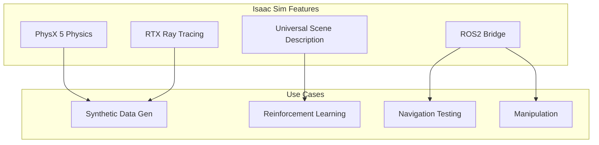

# Week 8: Isaac Sim Setup & Basics

Learn to use NVIDIA's photorealistic robot simulation platform.

## What is Isaac Sim?



## Installation

### System Requirements

| Component | Minimum | Recommended |
|-----------|---------|-------------|
| GPU | RTX 2070 | RTX 3080+ |
| VRAM | 8 GB | 16+ GB |
| RAM | 32 GB | 64 GB |
| Storage | 50 GB SSD | 100 GB NVMe |

### Install via Omniverse Launcher

```bash
# Download Omniverse Launcher
wget https://install.launcher.omniverse.nvidia.com/installers/omniverse-launcher-linux.AppImage

# Make executable and run
chmod +x omniverse-launcher-linux.AppImage
./omniverse-launcher-linux.AppImage
```

## First Robot Scene

```python
# Isaac Sim Python script
from omni.isaac.kit import SimulationApp

# Start simulation
simulation_app = SimulationApp({"headless": False})

from omni.isaac.core import World
from omni.isaac.wheeled_robots.robots import WheeledRobot

# Create world
world = World()

# Add robot
robot = WheeledRobot(
    prim_path="/World/Robot",
    name="my_robot",
    wheel_dof_names=["left_wheel", "right_wheel"]
)
world.scene.add(robot)

# Run simulation
world.reset()
while simulation_app.is_running():
    world.step(render=True)
    
simulation_app.close()
```

## Key Takeaways

1. **Isaac Sim** provides photorealistic simulation
2. **PhysX 5** enables accurate physics
3. **USD** format is the scene standard
4. **ROS2 Bridge** connects to robot stacks
