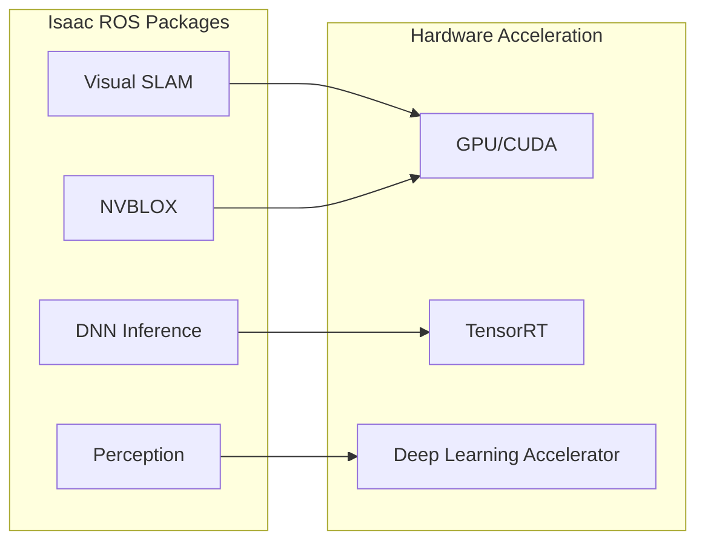

# Week 9: Isaac ROS Integration

Use NVIDIA's optimized ROS2 packages for perception and navigation.

## Isaac ROS Overview



## Installation

```bash
# Create Isaac ROS workspace
mkdir -p ~/isaac_ros_ws/src
cd ~/isaac_ros_ws/src

# Clone Isaac ROS Common
git clone https://github.com/NVIDIA-ISAAC-ROS/isaac_ros_common.git

# Build with colcon
cd ~/isaac_ros_ws
colcon build --symlink-install
```

## Visual SLAM Example

```python
# Launch Isaac ROS Visual SLAM
import launch
from launch_ros.actions import Node

def generate_launch_description():
    return launch.LaunchDescription([
        Node(
            package='isaac_ros_visual_slam',
            executable='visual_slam_node',
            parameters=[{
                'enable_imu_fusion': True,
                'gyro_noise_density': 0.000244,
                'accel_noise_density': 0.001862
            }],
            remappings=[
                ('visual_slam/camera_info', '/camera/camera_info'),
                ('visual_slam/image', '/camera/image_raw')
            ]
        )
    ])
```

## Key Takeaways

1. **Isaac ROS** provides GPU-accelerated perception
2. **NVBLOX** enables 3D reconstruction
3. **Visual SLAM** provides localization
4. **TensorRT** optimizes neural networks
