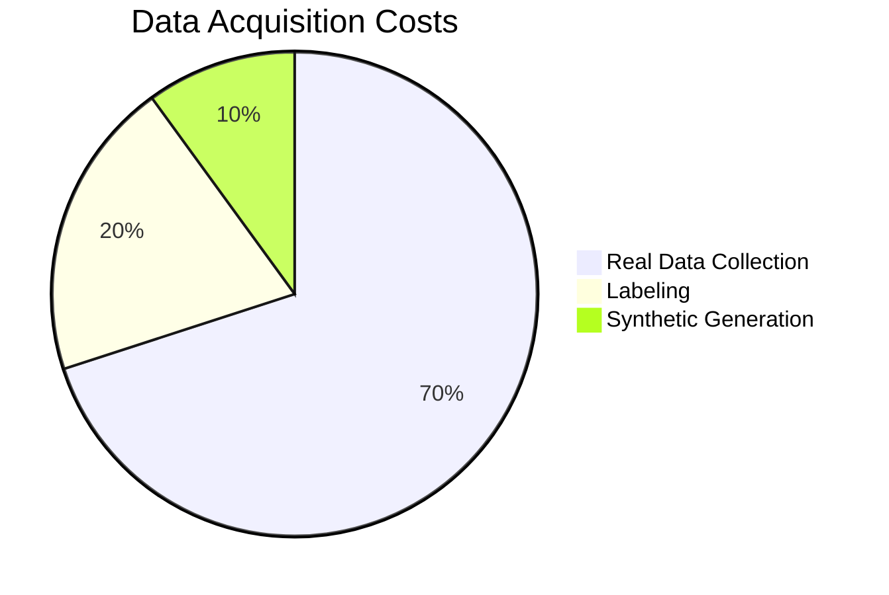

# Week 10: Synthetic Data Generation

Create unlimited training data with domain randomization.

## Why Synthetic Data?



## Domain Randomization

```python
from omni.isaac.core.utils.prims import create_prim
from omni.isaac.core.utils.rotations import euler_angles_to_quat
import numpy as np

class DomainRandomizer:
    def __init__(self, world):
        self.world = world
    
    def randomize_lighting(self):
        # Randomize light intensity
        intensity = np.random.uniform(500, 2000)
        # Randomize light color
        color = np.random.uniform(0.8, 1.0, size=3)
        return intensity, color
    
    def randomize_textures(self, prim_path):
        # Apply random material
        materials = ["wood", "metal", "plastic", "concrete"]
        material = np.random.choice(materials)
        return material
    
    def randomize_camera(self, base_pose):
        # Add noise to camera pose
        noise = np.random.normal(0, 0.05, size=6)
        return base_pose + noise
```

## Replicator Pipeline

```python
import omni.replicator.core as rep

with rep.new_layer():
    # Create camera
    camera = rep.create.camera(position=(0, 0, 5))
    
    # Create randomizers
    with rep.trigger.on_frame():
        rep.randomizer.rotation(
            rep.get.prims(semantics=[("class", "object")]),
            min_angle=-180, max_angle=180
        )
    
    # Setup writer
    writer = rep.WriterRegistry.get("BasicWriter")
    writer.initialize(
        output_dir="synthetic_data",
        rgb=True,
        bounding_box_2d_tight=True,
        semantic_segmentation=True
    )
    writer.attach([camera])
```

## Key Takeaways

1. **Synthetic data** reduces collection costs
2. **Domain randomization** improves generalization
3. **Replicator** automates data generation
4. **Annotations** are free and accurate
