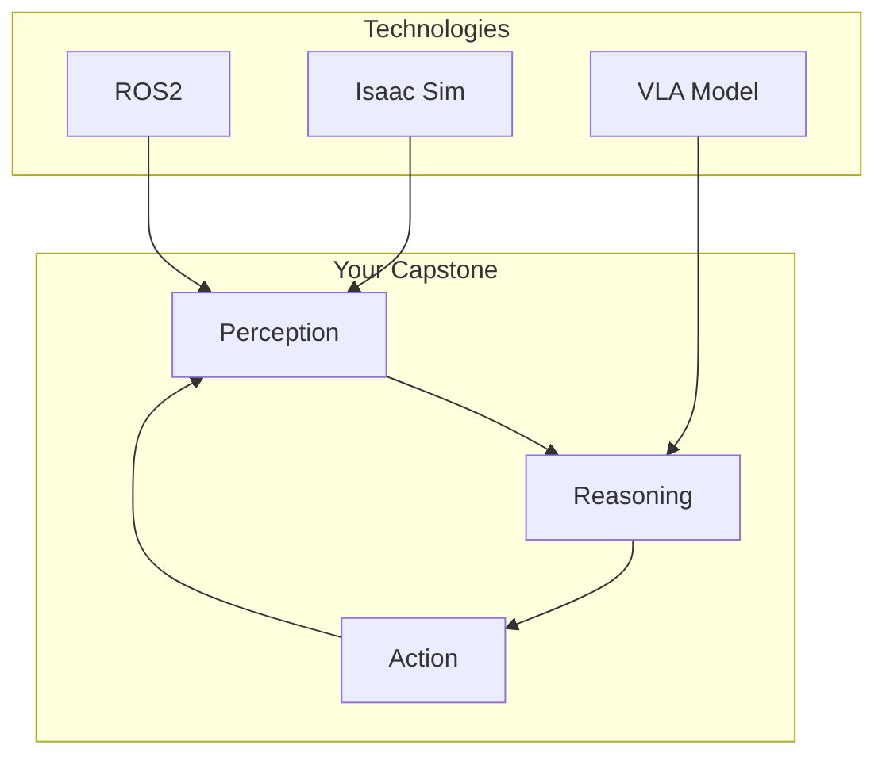
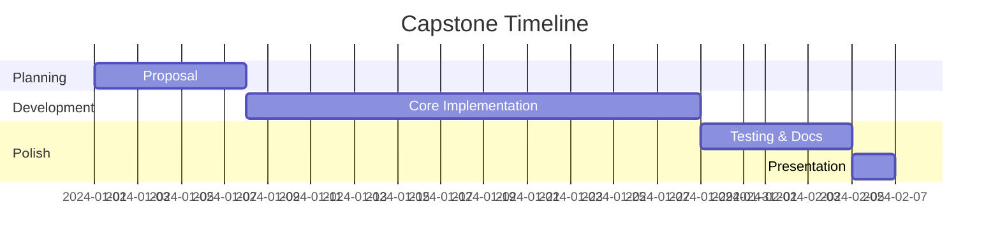

# Capstone Project

Build a complete Physical AI system integrating everything you've learned.

## Project Overview

## Project Options

### Option 1: Mobile Manipulator

Build a robot that can:
- Navigate to objects using Nav2
- Detect objects with vision
- Pick and place with VLA control

### Option 2: Humanoid Control

Build a system for:
- Bipedal walking simulation
- Gesture recognition
- Language-guided motion

### Option 3: Sim-to-Real Transfer

Demonstrate:
- Training in Isaac Sim
- Domain randomization
- Real robot deployment

## Requirements

| Requirement | Points |
|-------------|--------|
| Working demonstration | 40 |
| Code quality & documentation | 20 |
| Technical presentation | 15 |
| Novel contribution | 25 |

## Timeline

## Submission

1. GitHub repository with README
2. 5-minute demo video
3. Technical report (5-10 pages)
4. Live presentation

**Good luck with your capstone!** 🎓🤖
