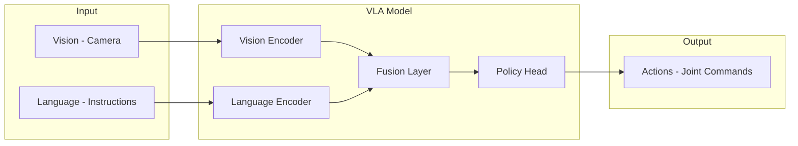

# Week 11: VLA Model Architecture

Understanding Vision-Language-Action models for robotics.

## What are VLA Models?



## Key VLA Models

| Model | Organization | Key Innovation |
|-------|--------------|----------------|
| RT-1 | Google | Tokenized actions |
| RT-2 | Google | VLM backbone |
| PaLM-E | Google | Embodied reasoning |
| OpenVLA | Stanford | Open weights |

## Architecture Deep Dive

```python
import torch
import torch.nn as nn
from transformers import CLIPModel, CLIPProcessor

class SimpleVLA(nn.Module):
    def __init__(self, action_dim=7):
        super().__init__()
        
        # Vision-Language backbone
        self.clip = CLIPModel.from_pretrained("openai/clip-vit-base-patch32")
        
        # Freeze CLIP
        for param in self.clip.parameters():
            param.requires_grad = False
        
        # Action head
        self.action_head = nn.Sequential(
            nn.Linear(512 + 512, 256),
            nn.ReLU(),
            nn.Linear(256, action_dim)
        )
    
    def forward(self, image, text):
        # Get embeddings
        vision_features = self.clip.get_image_features(image)
        text_features = self.clip.get_text_features(text)
        
        # Concatenate
        combined = torch.cat([vision_features, text_features], dim=-1)
        
        # Predict actions
        actions = self.action_head(combined)
        return actions
```

## Training Loop

```python
def train_step(model, batch, optimizer):
    images, instructions, target_actions = batch
    
    # Forward pass
    predicted_actions = model(images, instructions)
    
    # MSE loss for continuous actions
    loss = F.mse_loss(predicted_actions, target_actions)
    
    # Backward pass
    optimizer.zero_grad()
    loss.backward()
    optimizer.step()
    
    return loss.item()
```

## Key Takeaways

1. **VLA models** combine vision, language, and action
2. **Foundation models** provide strong priors
3. **Action tokenization** enables sequence modeling
4. **Multi-task training** improves generalization
