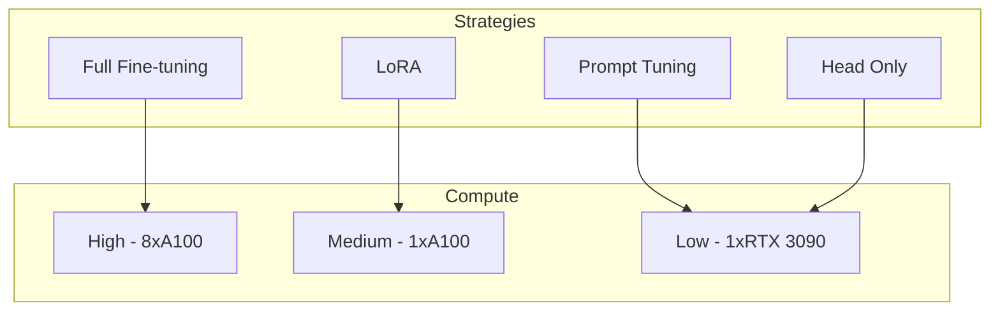

# Week 12: Fine-tuning for Robotics

Adapt foundation models to your specific robot and tasks.

## Fine-tuning Strategies



## LoRA Fine-tuning

```python
from peft import LoraConfig, get_peft_model

# Configure LoRA
lora_config = LoraConfig(
    r=16,                    # Rank
    lora_alpha=32,           # Scaling
    target_modules=["q_proj", "v_proj"],
    lora_dropout=0.1,
    bias="none"
)

# Apply to model
model = get_peft_model(base_model, lora_config)

# Check trainable parameters
model.print_trainable_parameters()
# Output: trainable params: 2M || all params: 400M || trainable%: 0.5%
```

## Data Collection

```python
class RobotDataCollector:
    def __init__(self, robot, camera):
        self.robot = robot
        self.camera = camera
        self.episodes = []
    
    def collect_episode(self, instruction):
        episode = {
            "instruction": instruction,
            "observations": [],
            "actions": []
        }
        
        while not self.is_done():
            # Capture observation
            image = self.camera.capture()
            episode["observations"].append(image)
            
            # Get human demonstration
            action = self.get_teleop_action()
            episode["actions"].append(action)
            
            # Execute
            self.robot.execute(action)
        
        self.episodes.append(episode)
```

## Key Takeaways

1. **LoRA** enables efficient fine-tuning
2. **Demonstrations** provide training signal
3. **Data diversity** is crucial
4. **Evaluation** should match deployment
