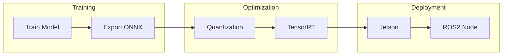

# Week 13: Deployment & Integration

Deploy your VLA models on real robot hardware.

## Deployment Pipeline



## Model Export

```python
import torch.onnx

def export_model(model, save_path):
    # Dummy inputs
    dummy_image = torch.randn(1, 3, 224, 224)
    dummy_text = torch.randint(0, 1000, (1, 77))
    
    # Export to ONNX
    torch.onnx.export(
        model,
        (dummy_image, dummy_text),
        save_path,
        input_names=['image', 'text'],
        output_names=['actions'],
        dynamic_axes={
            'image': {0: 'batch'},
            'text': {0: 'batch'}
        }
    )
```

## ROS2 Inference Node

```python
import rclpy
from rclpy.node import Node
from sensor_msgs.msg import Image
from std_msgs.msg import String
import numpy as np

class VLAInferenceNode(Node):
    def __init__(self):
        super().__init__('vla_inference')
        
        # Load model
        self.model = self.load_tensorrt_model()
        
        # Subscribers
        self.image_sub = self.create_subscription(
            Image, '/camera/image', self.image_callback, 10)
        self.instruction_sub = self.create_subscription(
            String, '/instruction', self.instruction_callback, 10)
        
        # Publisher
        self.action_pub = self.create_publisher(
            Float32MultiArray, '/robot/action', 10)
        
        self.current_instruction = None
    
    def instruction_callback(self, msg):
        self.current_instruction = msg.data
    
    def image_callback(self, msg):
        if self.current_instruction is None:
            return
        
        # Preprocess
        image = self.preprocess_image(msg)
        text = self.tokenize(self.current_instruction)
        
        # Inference
        action = self.model.infer(image, text)
        
        # Publish
        action_msg = Float32MultiArray(data=action.tolist())
        self.action_pub.publish(action_msg)
```

## Key Takeaways

1. **ONNX** provides portable model format
2. **TensorRT** optimizes for NVIDIA hardware
3. **ROS2** integrates model with robot stack
4. **Safety** must be considered for deployment
