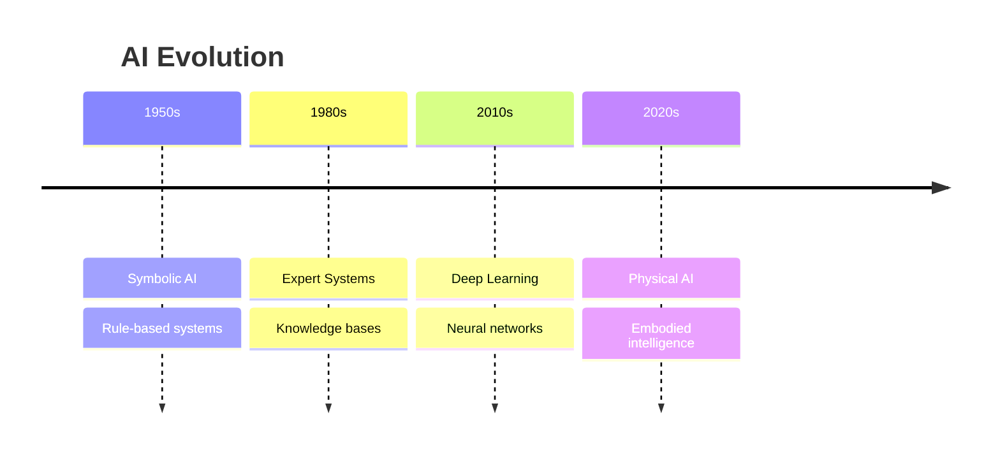

# Why Physical AI Matters

Physical AI represents the next frontier in artificial intelligence—moving beyond digital-only systems to create machines that can interact with the physical world.

## The Evolution of AI



## Key Drivers

### 1. Hardware Advances
- More powerful edge computing (NVIDIA Jetson)
- Better sensors (LiDAR, depth cameras)
- Improved actuators and motors

### 2. Software Breakthroughs
- Foundation models (GPT, CLIP, RT-2)
- Improved simulation (Isaac Sim, Gazebo)
- Better robot middleware (ROS2)

### 3. Industry Demand
- Labor shortages in manufacturing
- Aging populations need care robots
- Dangerous environments (mining, disaster response)

## Real-World Applications

| Industry | Application | Impact |
|----------|-------------|--------|
| Manufacturing | Assembly robots | 40% productivity increase |
| Healthcare | Surgical assistants | Reduced complications |
| Logistics | Warehouse automation | 24/7 operations |
| Agriculture | Harvesting robots | Reduced labor costs |

## Why Now?

```python
# The convergence of technologies
technologies = {
    "compute": "1000x more FLOPS than 2010",
    "data": "Billions of robot interaction hours",
    "algorithms": "Transformer architectures",
    "simulation": "Photorealistic physics engines"
}

# Result: Practical humanoid robots
for tech, advancement in technologies.items():
    print(f"✅ {tech}: {advancement}")
```

## The Humanoid Opportunity

Humanoid robots can work in environments designed for humans:
- Use human tools
- Navigate human spaces
- Interact naturally with people

> "The best interface is no interface. A humanoid robot doesn't require redesigning the world—it adapts to ours." — Industry Expert

## Course Relevance

By studying Physical AI, you're positioning yourself at the intersection of:

1. **Robotics Engineering** — Building the hardware
2. **AI/ML** — Creating the intelligence
3. **Systems Integration** — Making it all work together

This is one of the fastest-growing fields in technology, with major investments from Tesla, Google, Amazon, and dozens of startups.

**Your journey into Physical AI starts here.**
